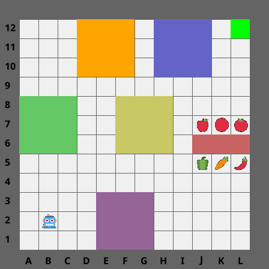
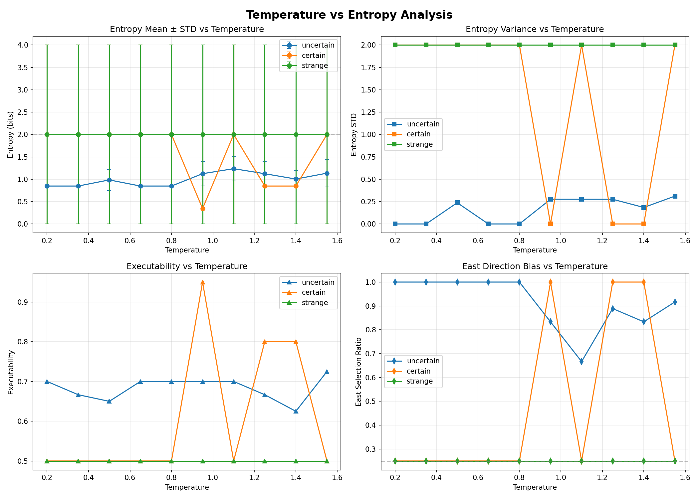

# Action Entropy 분석 보고서

## 목차
1. [개요](#개요)
2. [배경 및 목적](#배경-및-목적)
3. [방법론](#방법론)
4. [실험 설계](#실험-설계)
5. [초기 결과 및 문제점](#초기-결과-및-문제점)
6. [개선 과정](#개선-과정)
7. [Temperature 분석](#temperature-분석)
8. [결론 및 향후 과제](#결론-및-향후-과제)

---

## 개요

본 문서는 Gemini-2.5-flash 모델을 사용한 로봇 제어 시스템에서 **Action Entropy**를 추출하고 분석한 전체 과정을 기록합니다. Tian et al. (2023)의 이론을 기반으로, **Verbalized Confidence** 방식을 통해 모델의 내부 확률값 대신 직접 출력하는 수치적 확률을 사용하여 행동 불확실성을 측정했습니다.

### 핵심 개념

- **Action Entropy**: 로봇 행동의 불확실성을 측정하는 지표 (Shannon Entropy 기반)
- **Verbalized Confidence**: LLM이 직접 텍스트로 출력하는 확률값 (내부 log-probability 대신 사용)
- **Action Chunk (3-step)**: 로봇 행동을 3단계 시퀀스로 표현
- **Step-wise Probability Distribution**: 각 단계별로 4방향(north, south, west, east)에 대한 확률 분포

---

## 배경 및 목적

### 연구 배경

기존 LLM 기반 로봇 제어 시스템에서는 모델의 내부 확률값(log-probabilities)을 사용하여 불확실성을 측정했습니다. 그러나 Gemini-2.5-flash와 같은 RLHF(Reinforcement Learning from Human Feedback) 모델에서는 이러한 내부 확률값이 실제 신뢰도와 잘 교정(calibrated)되지 않는 문제가 있습니다.

### 연구 목적

1. **정확한 Action Entropy 추출**: 3-step Action Chunk를 유지하면서도 정확한 Action Entropy를 추출
2. **Verbalized Confidence 검증**: 모델이 직접 출력하는 확률값의 신뢰성 검증
3. **Temperature 영향 분석**: Temperature 변화에 따른 Entropy 분포 및 답변 경향성 분석
4. **편향(Bias) 문제 해결**: 특정 방향(특히 east)으로의 편향 문제 진단 및 개선

---

## 방법론

### 1. Verbalized Confidence 방식

Tian et al. (2023)의 논문을 기반으로, 모델 내부의 확률값 대신 **모델이 직접 텍스트로 출력하는 수치적 확률**을 사용합니다. 이는 Flash 모델과 같은 RLHF 모델에서 로그 확률값보다 훨씬 더 정확하게 교정된 값을 제공합니다.

### 2. Step-wise 확률 분포

초기에는 **시나리오 기반 확률 할당**을 시도했으나, 이후 **각 단계별 확률 분포**로 전환했습니다:

- **초기 방식**: 3개의 액션 슬롯을 "미래의 연속 동작"이 아니라 "현재 선택 가능한 상위 3가지 경로 시나리오(Path Scenarios)"로 재정의
- **최종 방식**: 각 Step(1, 2, 3)마다 4방향(north, south, west, east)에 대한 확률 분포를 직접 할당

### 3. Shannon Entropy 계산

각 Step의 Entropy는 다음과 같이 계산됩니다:

```
H(Step_i) = -Σ p(direction) × log₂(p(direction))
```

최종 Entropy는 가중 평균으로 계산됩니다:

```
Final Entropy = 0.5 × H(Step1) + 0.3 × H(Step2) + 0.2 × H(Step3)
```

가중치 선택 이유:
- Step 1이 가장 중요 (즉시 실행)
- Step 2, 3는 미래 예측이므로 낮은 가중치

### 4. Answer-Free Confidence Estimation (AFCE)

모델의 과잉 확신(overconfidence) 문제를 해결하기 위해, **답변 생성과 신뢰도 평가를 분리**하는 AFCE 방식을 도입했습니다:

1. 먼저 `executability` (0.0-1.0)를 평가
2. `executability`에 따라 확률 분포를 할당:
   - 높은 executability (0.7-1.0): 확률 집중 (0.7-0.95 on best direction)
   - 중간 executability (0.4-0.7): 중간 집중 (0.4-0.6 on likely directions)
   - 낮은 executability (0.0-0.4): 분산, 하지만 약간의 선호도 표시

---

## 실험 설계

### 실험 환경

- **모델**: Gemini-2.0-flash (Vertex AI)
- **이미지**: MiniGrid 환경 (`minigrid_debug.png`)
- **Temperature**: 0.2 ~ 1.5 (0.15 단위)
- **반복 횟수**: 각 조합당 5회



### Language Prompts (3종류)

| 유형 | 프롬프트 | 기대 결과 | 실제 결과 |
|------|----------|----------|----------|
| **불확실 (uncertain)** | "move toward toilet, usually colored room is toilet." | 높은 entropy, 분산된 확률 | Entropy 0.85~1.24, East bias 강함 |
| **확실 (certain)** | "i'm hungry. grab some apple" | 낮은 entropy, 집중된 확률 | 대부분 실패 (Entropy=2.0), 간헐적 성공 |
| **이상함 (strange)** | "find and move toward desktop pc" | 매우 높은 entropy (이미지에 없음) | 항상 Entropy=2.0 (완전 실패) |

### System Prompt 구조

최종 System Prompt는 다음과 같은 구조를 가집니다:

```
## ROLE
You are a well-calibrated robot controller that assigns probabilities to actions.

## ACTION SPACE
- "north": Move up (↑)
- "south": Move down (↓)
- "west": Move left (←)
- "east": Move right (→)

## IMAGE ANALYSIS
Analyze the image to identify:
- Robot position (blue agent)
- Target objects (fruits, goals, etc.)
- Obstacles (walls, barriers)
- Open paths

## TASK (Verbalized Confidence)
For each of 3 steps, answer: "What is the probability that each direction is CORRECT?"

## EXECUTABILITY
Rate how well you can execute the command (0.0 to 1.0):
- 1.0: Clear target visible, clear path
- 0.5-0.8: Target visible but path unclear, or partial match
- 0.1-0.4: Target not visible but can make educated guess
- 0.0: Cannot determine anything

## OUTPUT FORMAT (STRICT JSON)
{
  "executability": 0.0-1.0,
  "step1": {"north": P, "south": P, "west": P, "east": P},
  "step2": {"north": P, "south": P, "west": P, "east": P},
  "step3": {"north": P, "south": P, "west": P, "east": P},
  "best_guesses": ["direction1", "direction2", "direction3"],
  "reasoning": "Brief explanation (≤50 chars)"
}
```

---

## 초기 결과 및 문제점

### 1. 항상 높은 Entropy 문제

**문제**: 초기 실험에서 Entropy가 항상 높게 나타남 (거의 최대값 2.0 bits)

**원인 분석**:
- 모델이 명령을 이해하지 못할 때 균등 분포(각 방향 0.25)로 fallback
- 확률 할당 가이드라인이 불충분

**해결 시도**:
- 확률 할당에 대한 더 명시적인 가이드 추가
- Few-shot 예제 추가 (나중에 제거됨 - 악영향)

### 2. "Move East" 편향 문제

**문제**: 사용자가 다른 명령을 입력해도 항상 동쪽(east)으로 이동하려는 경향

**원인 분석**:
1. **이미지 편향**: MiniGrid 환경에서 타겟이 대부분 동쪽에 위치
2. **Positional Bias**: JSON 출력 형식에서 east가 마지막에 위치 (recency effect)
3. **모델의 고유 편향**: Gemini 모델 자체의 공간 추론 한계

**해결 시도**:
- 방향 순서를 알파벳 순으로 변경 (east, north, south, west) → **사용자 피드백: "이전이 나은 것 같아"** → 되돌림
- `CRITICAL: COMMAND PRIORITY` 섹션 추가 → **사용자 피드백: "안맞아"** → 되돌림

### 3. 명령어 변경이 확률 분포에 영향 없음

**문제**: Language command가 달라져도 Entropy가 불변, 특히 정확한 움직임 지정을 했는데도 확률이 특정 분포에 몰리지 않음

**원인 분석**:
- 프롬프트가 명령어 해석을 제대로 유도하지 못함
- JSON format 강제가 모델의 출력 분포에 영향을 줄 수 있음

**해결 시도**:
- `response_schema` 제거 (더 유연한 출력 허용)
- Temperature를 0.7에서 0.3으로 낮춤 (더 결정적)
- 명령어 해석에 대한 더 명시적인 가이드 추가

### 4. "Target not found" 시 하드코딩 문제

**문제**: "Hatsune Miku not found, moving east." 같이 특정 방향으로 하드코딩된 응답

**사용자 피드백**: 
> "아니 그딴 하드코딩 하지말라고. 근본원인이 뭔데? 참고문헌을 인터넷으로 찾아서, 나한테 보고하고, 반영해야 할거 아니야?"

**조사 결과**:
1. **Overconfidence**: LLM이 불확실한 상황에서도 과도하게 확신하는 경향
2. **Positional Bias**: 프롬프트나 출력 형식에서 위치에 따른 편향
3. **Gemini의 공간 추론 한계**: 이미지에서 객체를 찾지 못할 때 기본 방향으로 fallback

**해결책**: AFCE (Answer-Free Confidence Estimation) 도입
- 먼저 `executability`를 평가
- `executability`에 따라 확률 분포를 자연스럽게 할당
- 하드코딩된 규칙 제거, 일반화된 확률 분포 생성

### 5. Executability=0.0일 때 Entropy 고정 문제

**문제**: `executability`가 0.0일 때 Entropy가 항상 2.0 (완전 균등 분포)으로 고정

**원인**: 프롬프트의 `max_prob ≈ 0.25 + (0.75 × executability)` 공식이 너무 경직됨

**해결**: 
- 명시적 공식 제거
- "avoid exact values like 0.25, 0.50" 지시 추가
- "show any slight preferences" 지시로 자연스러운 변동 유도

---

## 개선 과정

### Phase 1: 시나리오 기반 → Step-wise 전환

**변경 사항**:
- 3개의 경로 시나리오 대신, 각 Step별 4방향 확률 분포로 전환
- 더 직관적이고 해석하기 쉬운 구조

### Phase 2: AFCE 도입

**변경 사항**:
- `executability` 필드 추가
- 확률 할당을 executability 기반으로 일반화
- 하드코딩된 규칙 제거

### Phase 3: 프롬프트 최적화

**변경 사항**:
- `IMAGE ANALYSIS` 섹션 추가
- `HOW TO THINK` 섹션에서 이미지 분석과 명령 해석 결합 가이드
- `EXECUTABILITY` 정의 명확화

### Phase 4: 가중 평균 Entropy

**변경 사항**:
- Step 1, 2, 3에 대해 50%, 30%, 20% 가중치 적용
- Step 1의 중요성 반영

---

## Temperature 분석

### 실험 개요

Temperature 0.2부터 1.5까지 0.15 단위로 변화시키며, 3가지 프롬프트에 대해 각각 5회씩 반복 실험을 수행했습니다.

### 주요 결과



#### 1. Entropy Mean ± STD vs Temperature

**uncertain 프롬프트**:
- Entropy: 0.85~1.24 bits (중간 수준)
- Temperature가 높아질수록 분산 증가 (0.95 이상에서 뚜렷)
- 낮은 Temperature (0.2~0.8)에서는 매우 안정적 (STD ≈ 0)

**certain 프롬프트**:
- 대부분 Temperature에서 Entropy=2.0 (실패)
- Temperature 0.95, 1.25, 1.4에서만 유의미한 응답 (Entropy 0.34~0.85)
- 매우 불안정한 패턴 (STD가 0에서 2.0까지 급변)

**strange 프롬프트**:
- 모든 Temperature에서 Entropy=2.0 (완전 실패)
- 완전히 균등한 분포 유지

#### 2. Direction Distribution Heatmap


**uncertain 프롬프트**:
- East 방향으로 강하게 편향 (0.67~1.0)
- 낮은 Temperature (0.2~0.8)에서는 East=1.0 (100%)
- 고온에서 North로 약간 분산

**certain 프롬프트**:
- 낮은 Temperature에서 균등 분포 (각 0.25)
- 특정 Temperature (0.95, 1.25, 1.4)에서 East=1.0으로 급증
- 매우 불안정한 패턴

**strange 프롬프트**:
- 모든 Temperature에서 균등 분포 (각 0.25)
- 편향 없음

#### 3. Entropy Distribution Box Plot


**주요 관찰**:
- **uncertain**: 낮은 Temperature에서 낮고 안정적인 Entropy, 고온에서 분산 증가
- **certain**: 대부분 실패하지만, 특정 Temperature에서만 성공
- **strange**: 항상 최대 Entropy (2.0 bits)로 고정

### Executability 분석

| 프롬프트 | Executability 범위 | 특징 |
|---------|-------------------|------|
| **uncertain** | 0.62~0.72 | 중간 수준, 안정적 |
| **certain** | 0.5 (실패 시) / 0.8~0.95 (성공 시) | 간헐적 성공 |
| **strange** | 0.5 (항상) | 완전 실패 |

### 핵심 발견

1. **Temperature 효과**:
   - 낮은 Temperature: 더 결정적, 낮은 분산
   - 높은 Temperature: 더 다양한 응답, 높은 분산
   - 하지만 프롬프트 유형에 따라 효과가 다름

2. **프롬프트별 특성**:
   - **uncertain**: Temperature에 민감, 중간 수준 Entropy 유지
   - **certain**: 매우 불안정, 특정 Temperature에서만 성공
   - **strange**: Temperature에 무관하게 항상 실패

3. **East Bias**:
   - **uncertain** 프롬프트에서 매우 강함 (특히 낮은 Temperature)
   - **certain** 프롬프트에서도 간헐적으로 나타남
   - **strange** 프롬프트에서는 편향 없음 (균등 분포)

4. **Gemini-2.0-flash의 한계**:
   - MiniGrid 환경에서 일반 객체("apple", "desktop pc") 인식 실패
   - "toilet = colored room" 같은 힌트가 있어야 동작
   - 인식 실패 시 균등 분포(Entropy=2.0)로 fallback

---

## 결론 및 향후 과제

### 주요 성과

1. **Verbalized Confidence 방식 검증**: 모델이 직접 출력하는 확률값을 사용하여 Action Entropy를 성공적으로 추출
2. **Step-wise 확률 분포**: 각 단계별 확률 분포를 추출하여 더 세밀한 분석 가능
3. **AFCE 도입**: 과잉 확신 문제를 완화하고 일반화된 확률 분포 생성
4. **Temperature 분석**: Temperature 변화에 따른 Entropy 분포 및 경향성 파악

### 남은 문제점

1. **East Bias**: 여전히 동쪽으로의 강한 편향이 존재 (특히 uncertain 프롬프트)
2. **객체 인식 한계**: MiniGrid 환경에서 일반 객체를 인식하지 못함
3. **불안정성**: certain 프롬프트에서 Temperature에 따른 매우 불안정한 응답

### 향후 과제

1. **편향 완화**:
   - 이미지 편향 해결 (다양한 타겟 위치)
   - Positional bias 완화를 위한 프롬프트 개선
   - 모델의 공간 추론 능력 향상

2. **객체 인식 개선**:
   - Few-shot 예제 추가 (하지만 이전에 악영향을 준 경험 고려)
   - 이미지 전처리 또는 객체 감지 모델 결합
   - 더 명확한 객체 설명 추가

3. **안정성 향상**:
   - Temperature 스케줄링
   - Ensemble 방법 도입
   - Calibration 기법 추가

4. **추가 분석**:
   - 다른 모델 (Gemini-2.5-flash, GPT-4V)과 비교
   - 다양한 환경에서의 일반화 성능 평가
   - 실제 로봇 제어 루프에서의 Entropy 활용 검증

---

## 참고 자료

### 코드 위치

- **노트북**: `src/test_script/action_entropy/gemini_action_export.ipynb`
- **Temperature 분석 스크립트**: `src/test_script/action_entropy/temperature_analysis/temperature_entropy_analysis.py`
- **결과 데이터**: `src/test_script/action_entropy/temperature_analysis/results/run_20260127_004251/`

### 관련 문서

- Tian et al. (2023) - Verbalized Confidence 논문
- [Temperature Analysis README](../test_script/action_entropy/temperature_analysis/README.md)

---

**작성일**: 2026-01-27  
**작성자**: AI Assistant (사용자 피드백 기반)  
**버전**: 1.0
