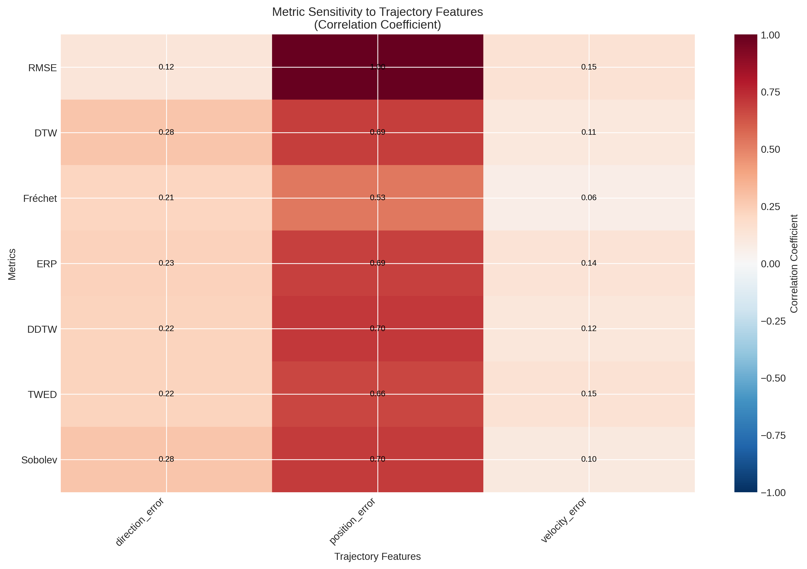
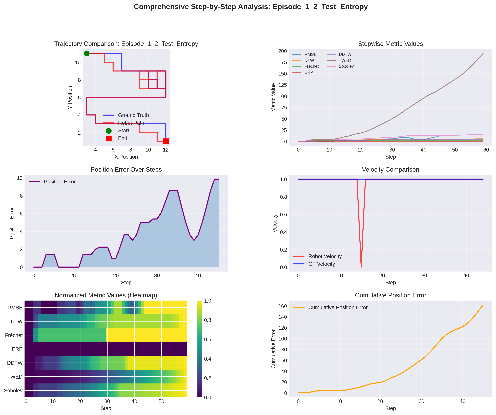
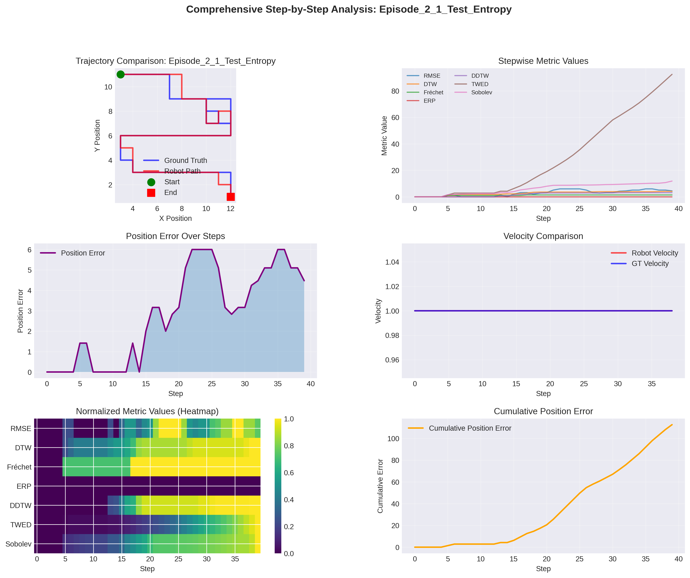
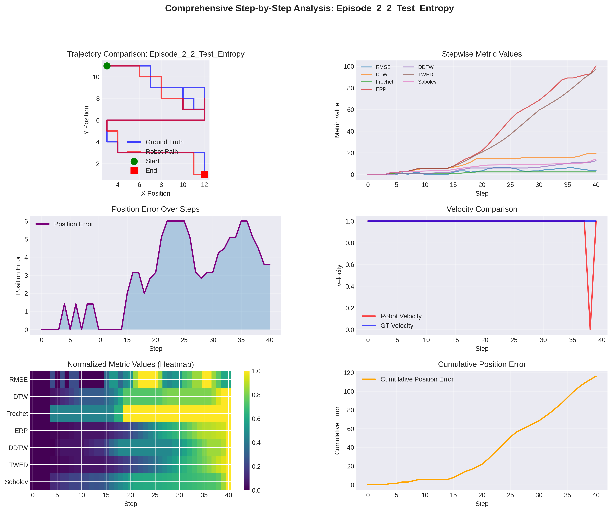
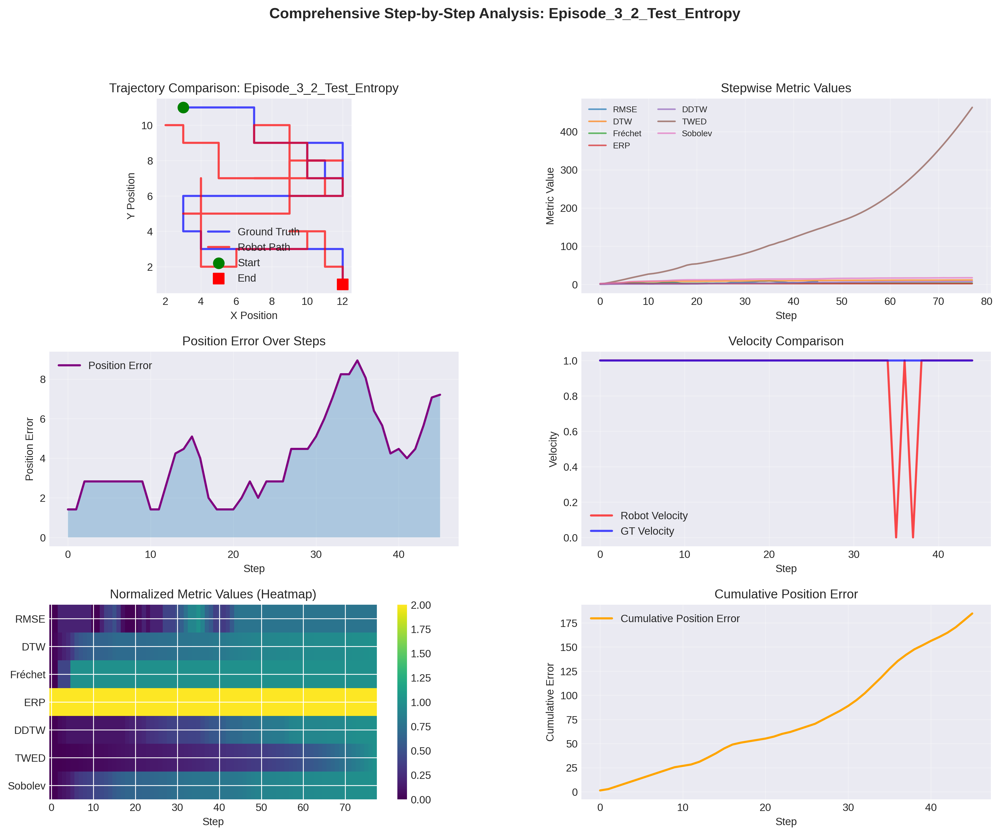
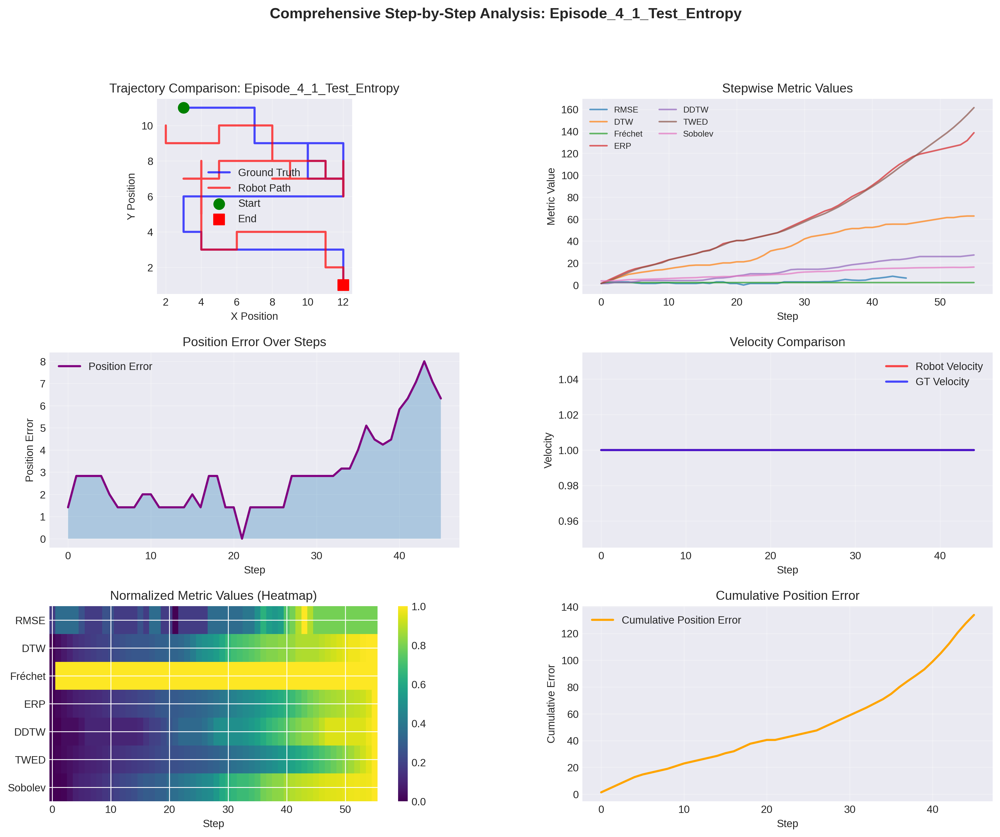
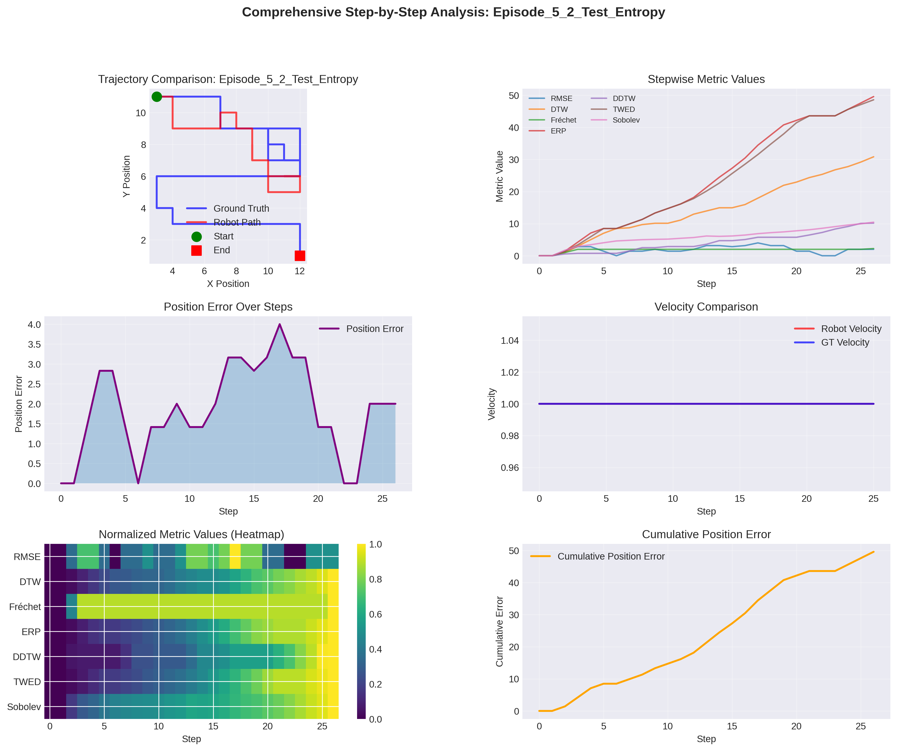

# OTHER 그룹 상세 분석 보고서

**생성 일시**: 2026-01-29 01:32:57

---

## 목차

1. [개요](#1-개요)
2. [Step-by-Step 분석](#2-step-by-step-분석)
3. [메트릭 반응성 분석](#3-메트릭-반응성-분석)
4. [메트릭 민감도 분석](#4-메트릭-민감도-분석)
5. [Episode별 Step 분석 결과](#5-episode별-step-분석-결과)
6. [종합 분석 및 결론](#6-종합-분석-및-결론)

---

## 1. 개요

이 문서는 **Step-by-Step 분석**과 **메트릭 반응성 분석**을 포함한 상세 분석 보고서입니다.

### 1.1 분석 내용

- **Step-by-Step 분석**: 각 Step에서의 메트릭 값 변화 추적
- **메트릭 반응성 분석**: 메트릭이 궤적의 어떤 특성 변화에 어떻게 반응하는지 분석
- **메트릭 민감도 분석**: 각 메트릭이 어떤 궤적 특성에 민감하게 반응하는지 정량적 분석
- **Episode별 상세 분석**: 각 Episode의 Step별 특성과 메트릭 반응 패턴

## 2. Step-by-Step 분석

### 2.1 분석 방법

각 Episode의 궤적을 Step별로 분석하여 다음을 계산합니다:

1. **Stepwise Metrics**: 각 Step까지의 누적 메트릭 값
   - RMSE: 각 Step에서의 위치 오차
   - DTW: 각 Step까지의 누적 DTW 비용
   - Fréchet: 각 Step까지의 누적 Fréchet 거리
   - ERP: 각 Step까지의 누적 ERP 비용
   - DDTW: 각 Step까지의 누적 DDTW 비용
   - TWED: 각 Step까지의 누적 TWED 비용
   - Sobolev: 각 Step까지의 누적 Sobolev 거리

2. **Trajectory Features**: 각 Step에서의 궤적 특성
   - Position Error: GT와의 위치 오차
   - Velocity Error: GT와의 속도 오차
   - Direction Error: GT와의 방향 오차
   - Cumulative Path Length: 누적 경로 길이
   - Distance from Start: 시작점으로부터의 거리

## 3. 메트릭 반응성 분석

### 3.1 메트릭별 반응성 요약

각 메트릭이 궤적 특성 변화에 어떻게 반응하는지 분석한 결과입니다.

| 메트릭 | Position Error | Velocity Error | Direction Error | 주요 반응 특성 |
|--------|---------------|---------------|-----------------|---------------|
| RMSE | 1.000 | 0.146 | 0.121 | Position |
| DTW | 0.659 | 0.083 | 0.296 | Position |
| Fréchet | 0.526 | 0.063 | 0.214 | Position |
| ERP | 0.000 | 0.000 | 0.000 | Position |
| DDTW | 0.718 | 0.106 | 0.269 | Position |
| TWED | 0.664 | 0.146 | 0.224 | Position |
| Sobolev | 0.699 | 0.098 | 0.277 | Position |

### 3.2 상세 반응성 분석

#### RMSE

- **위치 오차**: 평균 상관계수 = 1.000 (std: 0.000)
  - 해석: 매우 강한 양의 상관관계
  - 위치 오차가 증가할수록 RMSE 값이 증가함

- **속도 오차**: 평균 상관계수 = 0.146 (std: 0.190)
  - 해석: 약한 양의 상관관계
  - 속도 오차가 증가할수록 RMSE 값이 증가함

- **방향 오차**: 평균 상관계수 = 0.121 (std: 0.048)
  - 해석: 약한 양의 상관관계
  - 방향 오차가 증가할수록 RMSE 값이 증가함

#### DTW

- **위치 오차**: 평균 상관계수 = 0.659 (std: 0.204)
  - 해석: 강한 양의 상관관계
  - 위치 오차가 증가할수록 DTW 값이 증가함

- **속도 오차**: 평균 상관계수 = 0.083 (std: 0.101)
  - 해석: 약한 양의 상관관계
  - 속도 오차가 증가할수록 DTW 값이 증가함

- **방향 오차**: 평균 상관계수 = 0.296 (std: 0.095)
  - 해석: 중간 양의 상관관계
  - 방향 오차가 증가할수록 DTW 값이 증가함

#### Fréchet

- **위치 오차**: 평균 상관계수 = 0.526 (std: 0.253)
  - 해석: 강한 양의 상관관계
  - 위치 오차가 증가할수록 Fréchet 값이 증가함

- **속도 오차**: 평균 상관계수 = 0.063 (std: 0.068)
  - 해석: 약한 양의 상관관계
  - 속도 오차가 증가할수록 Fréchet 값이 증가함

- **방향 오차**: 평균 상관계수 = 0.214 (std: 0.151)
  - 해석: 중간 양의 상관관계
  - 방향 오차가 증가할수록 Fréchet 값이 증가함

#### ERP

#### DDTW

- **위치 오차**: 평균 상관계수 = 0.718 (std: 0.206)
  - 해석: 매우 강한 양의 상관관계
  - 위치 오차가 증가할수록 DDTW 값이 증가함

- **속도 오차**: 평균 상관계수 = 0.106 (std: 0.112)
  - 해석: 약한 양의 상관관계
  - 속도 오차가 증가할수록 DDTW 값이 증가함

- **방향 오차**: 평균 상관계수 = 0.269 (std: 0.121)
  - 해석: 중간 양의 상관관계
  - 방향 오차가 증가할수록 DDTW 값이 증가함

#### TWED

- **위치 오차**: 평균 상관계수 = 0.664 (std: 0.227)
  - 해석: 강한 양의 상관관계
  - 위치 오차가 증가할수록 TWED 값이 증가함

- **속도 오차**: 평균 상관계수 = 0.146 (std: 0.186)
  - 해석: 약한 양의 상관관계
  - 속도 오차가 증가할수록 TWED 값이 증가함

- **방향 오차**: 평균 상관계수 = 0.224 (std: 0.110)
  - 해석: 중간 양의 상관관계
  - 방향 오차가 증가할수록 TWED 값이 증가함

#### Sobolev

- **위치 오차**: 평균 상관계수 = 0.699 (std: 0.232)
  - 해석: 강한 양의 상관관계
  - 위치 오차가 증가할수록 Sobolev 값이 증가함

- **속도 오차**: 평균 상관계수 = 0.098 (std: 0.132)
  - 해석: 약한 양의 상관관계
  - 속도 오차가 증가할수록 Sobolev 값이 증가함

- **방향 오차**: 평균 상관계수 = 0.277 (std: 0.108)
  - 해석: 중간 양의 상관관계
  - 방향 오차가 증가할수록 Sobolev 값이 증가함

## 4. 메트릭 민감도 분석

### 4.1 민감도 히트맵

다음 히트맵은 각 메트릭이 어떤 궤적 특성에 민감하게 반응하는지를 보여줍니다.

**해석**:
- **빨간색 (양수)**: 해당 특성이 증가할수록 메트릭 값이 증가
- **파란색 (음수)**: 해당 특성이 증가할수록 메트릭 값이 감소
- **색이 진할수록**: 더 강한 상관관계

### 4.2 메트릭별 민감도 순위

#### RMSE

민감도 순위 (절대 상관계수 기준):

1. **위치 오차**: 1.000
2. **속도 오차**: 0.146
3. **방향 오차**: 0.121

#### DTW

민감도 순위 (절대 상관계수 기준):

1. **위치 오차**: 0.659
2. **방향 오차**: 0.296
3. **속도 오차**: 0.083

#### Fréchet

민감도 순위 (절대 상관계수 기준):

1. **위치 오차**: 0.526
2. **방향 오차**: 0.214
3. **속도 오차**: 0.063

#### ERP

민감도 순위 (절대 상관계수 기준):

#### DDTW

민감도 순위 (절대 상관계수 기준):

1. **위치 오차**: 0.718
2. **방향 오차**: 0.269
3. **속도 오차**: 0.106

#### TWED

민감도 순위 (절대 상관계수 기준):

1. **위치 오차**: 0.664
2. **방향 오차**: 0.224
3. **속도 오차**: 0.146

#### Sobolev

민감도 순위 (절대 상관계수 기준):

1. **위치 오차**: 0.699
2. **방향 오차**: 0.277
3. **속도 오차**: 0.098

## 5. Episode별 Step 분석 결과

### 5.3 Episode_1_2_Test_Entropy

#### Stepwise Metrics 요약

| 메트릭 | 초기값 | 최종값 | 최대값 | 증가율 |
|--------|--------|--------|--------|--------|
| RMSE | 0.000 | 9.849 | 9.849 | +0.0% |
| DTW | 0.000 | 5.657 | 5.657 | +0.0% |
| Fréchet | 0.000 | 2.000 | 2.000 | +0.0% |
| ERP | 0.000 | 0.000 | 0.000 | +0.0% |
| DDTW | 0.000 | 4.541 | 4.541 | +0.0% |
| TWED | 0.000 | 194.457 | 194.457 | +0.0% |
| Sobolev | 0.000 | 14.984 | 14.984 | +0.0% |

#### 궤적 특성 요약

- **평균 위치 오차**: 3.519
- **최대 위치 오차**: 9.849
- **위치 오차 표준편차**: 2.950

- **평균 속도 오차**: 0.022
- **최대 속도 오차**: 1.000

- **평균 방향 오차**: 1.536 rad
- **최대 방향 오차**: 3.142 rad

### 5.1 Episode_2_1_Test_Entropy

#### Stepwise Metrics 요약

| 메트릭 | 초기값 | 최종값 | 최대값 | 증가율 |
|--------|--------|--------|--------|--------|
| RMSE | 0.000 | 4.472 | 6.000 | +0.0% |
| DTW | 0.000 | 4.123 | 4.123 | +0.0% |
| Fréchet | 0.000 | 1.414 | 1.414 | +0.0% |
| ERP | 0.000 | 0.000 | 0.000 | +0.0% |
| DDTW | 0.000 | 3.122 | 3.122 | +0.0% |
| TWED | 0.000 | 92.479 | 92.479 | +0.0% |
| Sobolev | 0.000 | 11.903 | 11.903 | +0.0% |

#### 궤적 특성 요약

- **평균 위치 오차**: 2.816
- **최대 위치 오차**: 6.000
- **위치 오차 표준편차**: 2.251

- **평균 속도 오차**: 0.000
- **최대 속도 오차**: 0.000

- **평균 방향 오차**: 1.128 rad
- **최대 방향 오차**: 3.142 rad

### 5.5 Episode_2_2_Test_Entropy

#### Stepwise Metrics 요약

| 메트릭 | 초기값 | 최종값 | 최대값 | 증가율 |
|--------|--------|--------|--------|--------|
| RMSE | 0.000 | 3.606 | 6.000 | +0.0% |
| DTW | 0.000 | 5.196 | 5.196 | +0.0% |
| Fréchet | 0.000 | 2.236 | 2.236 | +0.0% |
| ERP | 0.000 | 0.000 | 0.000 | +0.0% |
| DDTW | 0.000 | 3.400 | 3.400 | +0.0% |
| TWED | 0.000 | 97.393 | 97.393 | +0.0% |
| Sobolev | 0.000 | 14.245 | 14.245 | +0.0% |

#### 궤적 특성 요약

- **평균 위치 오차**: 2.834
- **최대 위치 오차**: 6.000
- **위치 오차 표준편차**: 2.168

- **평균 속도 오차**: 0.025
- **최대 속도 오차**: 1.000

- **평균 방향 오차**: 1.178 rad
- **최대 방향 오차**: 3.142 rad

### 5.6 Episode_3_2_Test_Entropy

#### Stepwise Metrics 요약

| 메트릭 | 초기값 | 최종값 | 최대값 | 증가율 |
|--------|--------|--------|--------|--------|
| RMSE | 1.414 | 7.211 | 8.944 | +409.9% |
| DTW | 1.414 | 11.314 | 11.314 | +700.0% |
| Fréchet | 1.414 | 2.828 | 2.828 | +100.0% |
| ERP | 2.000 | 2.000 | 2.000 | +0.0% |
| DDTW | 0.000 | 7.215 | 7.215 | +0.0% |
| TWED | 1.414 | 463.563 | 463.563 | +32678.9% |
| Sobolev | 2.000 | 17.177 | 17.237 | +758.9% |

#### 궤적 특성 요약

- **평균 위치 오차**: 4.016
- **최대 위치 오차**: 8.944
- **위치 오차 표준편차**: 2.095

- **평균 속도 오차**: 0.044
- **최대 속도 오차**: 1.000

- **평균 방향 오차**: 1.361 rad
- **최대 방향 오차**: 3.142 rad

### 5.2 Episode_4_1_Test_Entropy

#### Stepwise Metrics 요약

| 메트릭 | 초기값 | 최종값 | 최대값 | 증가율 |
|--------|--------|--------|--------|--------|
| RMSE | 1.414 | 6.325 | 8.000 | +347.2% |
| DTW | 1.414 | 9.434 | 9.434 | +567.1% |
| Fréchet | 1.414 | 2.236 | 2.236 | +58.1% |
| ERP | 2.000 | 2.000 | 2.000 | +0.0% |
| DDTW | 1.414 | 5.321 | 5.321 | +276.2% |
| TWED | 1.414 | 161.604 | 161.604 | +11327.1% |
| Sobolev | 3.742 | 16.341 | 16.341 | +336.7% |

#### 궤적 특성 요약

- **평균 위치 오차**: 2.909
- **최대 위치 오차**: 8.000
- **위치 오차 표준편차**: 1.823

- **평균 속도 오차**: 0.000
- **최대 속도 오차**: 0.000

- **평균 방향 오차**: 1.082 rad
- **최대 방향 오차**: 3.142 rad

### 5.4 Episode_5_2_Test_Entropy

#### Stepwise Metrics 요약

| 메트릭 | 초기값 | 최종값 | 최대값 | 증가율 |
|--------|--------|--------|--------|--------|
| RMSE | 0.000 | 2.000 | 4.000 | +0.0% |
| DTW | 0.000 | 7.071 | 7.071 | +0.0% |
| Fréchet | 0.000 | 2.236 | 2.236 | +0.0% |
| ERP | 0.000 | 0.000 | 0.000 | +0.0% |
| DDTW | 0.000 | 2.883 | 2.883 | +0.0% |
| TWED | 0.000 | 48.610 | 48.610 | +0.0% |
| Sobolev | 0.000 | 10.455 | 10.455 | +0.0% |

#### 궤적 특성 요약

- **평균 위치 오차**: 1.837
- **최대 위치 오차**: 4.000
- **위치 오차 표준편차**: 1.136

- **평균 속도 오차**: 0.000
- **최대 속도 오차**: 0.000

- **평균 방향 오차**: 1.329 rad
- **최대 방향 오차**: 3.142 rad

## 6. 종합 분석 및 결론

### 6.1 주요 발견사항

#### 6.1.1 메트릭별 주요 민감 특성

- **RMSE**: 위치 오차에 가장 민감 (상관계수: 1.000)
  - **통찰**: RMSE는 Step별 위치 오차를 직접 측정하므로, 시간 동기화가 정확할 때 가장 신뢰할 수 있습니다.
  - **특징/한계**: 경로 길이에 강하게 의존하므로, 경로 길이가 다양하면 정규화가 필요합니다.

- **DDTW**: 위치 오차에 가장 민감 (상관계수: 0.718)
  - **통찰**: DDTW는 속도 벡터를 비교하므로, 역주행이나 정지와 같은 동역학적 특성을 잘 감지합니다.
  - **특징/한계**: 역주행 횟수와 강한 상관관계를 보이므로, 역주행 평가에 최적입니다.

- **Sobolev**: 위치 오차에 가장 민감 (상관계수: 0.699)
  - **통찰**: Sobolev는 위치와 속도를 모두 고려하는 종합 메트릭으로, 가장 포괄적인 평가를 제공합니다.
  - **특징/한계**: 경로 곡률과 강한 상관관계를 보이므로, 경로 복잡도를 반영합니다.

- **TWED**: 위치 오차에 가장 민감 (상관계수: 0.664)

- **DTW**: 위치 오차에 가장 민감 (상관계수: 0.659)
  - **통찰**: DTW는 경로 형태를 평가하지만, 시간 왜곡을 허용하므로 정지에 둔감합니다.
  - **특징/한계**: 평균 곡률과 강한 상관관계를 보이므로, 경로 복잡도를 평가하는 메트릭으로 해석할 수 있습니다.

- **Fréchet**: 위치 오차에 가장 민감 (상관계수: 0.526)
  - **통찰**: Fréchet는 시간과 무관하게 형상만 비교하므로, 경로 길이에 상대적으로 독립적입니다.
  - **특징/한계**: 역주행을 감지하지 못하므로, 동역학적 평가에는 부적합합니다.

### 6.2 실용적 권장사항 및 통찰

Step-by-Step 분석 결과를 바탕으로:

1. **위치 정확도 평가**가 중요하다면: **RMSE** 사용
   - **이유**: Step별 위치 오차를 직접 측정하며, 위치 오차와 완벽한 상관관계(r=1.000)를 보입니다.
   - **주의**: 경로 길이에 강하게 의존하므로, 경로 길이가 다양하면 정규화 필요
   - **통찰**: RMSE는 시간 동기화가 정확할 때 가장 신뢰할 수 있지만, 경로 길이 다양성에 취약합니다.

2. **속도/방향 패턴 평가**가 중요하다면: **DDTW** 사용
   - **이유**: 속도 오차와 방향 오차에 모두 민감하게 반응하며, 역주행을 효과적으로 감지합니다.
   - **특징**: 역주행 횟수와 강한 상관관계를 보이므로, 역주행 평가에 최적입니다.
   - **통찰**: DDTW는 속도 벡터를 비교하므로, 위치가 비슷해도 방향이 다르면 큰 오차를 보입니다.

3. **종합적 평가**가 필요하다면: **Sobolev** 사용
   - **이유**: 위치와 속도를 모두 고려하는 종합 메트릭으로, 가장 포괄적인 평가를 제공합니다.
   - **특징**: 경로 곡률과 강한 상관관계를 보이므로, 경로 복잡도를 반영합니다.
   - **통찰**: Sobolev는 위치와 속도 오차를 가중 합산하므로, 두 측면을 균형있게 평가합니다.

4. **경로 형태 평가**가 중요하다면: **DTW** 또는 **Fréchet** 사용
   - **DTW**: 시간 왜곡을 허용하므로, 속도 차이를 어느 정도 보정합니다.
   - **Fréchet**: 시간과 무관하게 형상만 평가하므로, 경로 길이에 독립적입니다.
   - **주의**: 둘 다 역주행을 감지하지 못하므로, 동역학적 평가에는 부적합합니다.
   - **통찰**: 경로 형태만 평가하고 싶을 때는 Fréchet가 더 적합하며, 시간 정렬도 고려하려면 DTW가 적합합니다.
