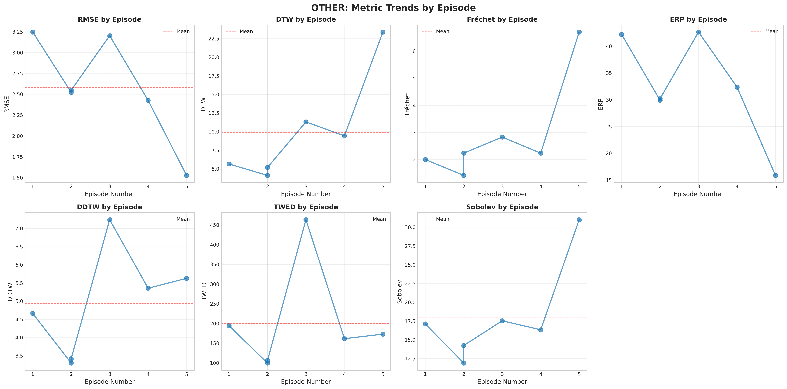
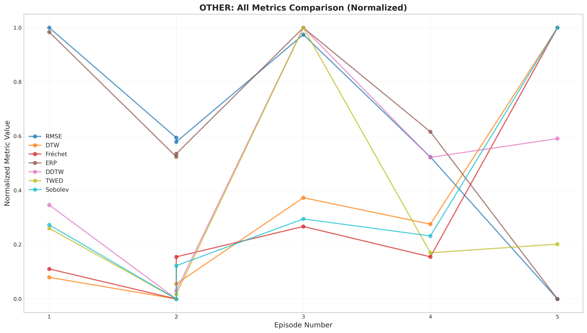

# OTHER 그룹 종합 분석 보고서

---

## 목차

1. [데이터 개요](#1-데이터-개요)
2. [궤적 특성 분석](#2-궤적-특성-분석)
3. [메트릭 통계 분석](#3-메트릭-통계-분석)
4. [상관관계 분석](#4-상관관계-분석)
5. [통계적 유의성 검정](#5-통계적-유의성-검정)
6. [메트릭 경향성과 궤적 특성의 관계](#6-메트릭-경향성과-궤적-특성의-관계)
7. [Episode 증가에 따른 경향성 종합 분석](#7-episode-증가에-따른-경향성-종합-분석)
8. [이 실험 데이터에 적합한 메트릭 분석](#8-이-실험-데이터에-적합한-메트릭-분석)
9. [결론 및 권장사항](#9-결론-및-권장사항)

---

## 1. 데이터 개요

### 1.1 Episode 정보

| Episode | Episode 번호 | 경로 길이 (steps) |
|---------|--------------|-------------------|
| Episode_1_2_Test_Entropy | 1 | 60 |
| Episode_2_1_Test_Entropy | 2 | 40 |
| Episode_2_2_Test_Entropy | 2 | 41 |
| Episode_3_2_Test_Entropy | 3 | 78 |
| Episode_4_1_Test_Entropy | 4 | 56 |
| Episode_5_2_Test_Entropy | 5 | 27 |

## 2. 궤적 특성 분석

### 2.1 경로 길이 및 효율성

- **평균 경로 길이**: 48.50 (std: 15.83)
- **경로 길이 범위**: 26.00 ~ 75.00
- **평균 효율성 (displacement/path_length)**: 0.280 (std: 0.064)

### 2.2 속도 특성

- **평균 속도**: 0.986 (std: 0.014)
- **속도 분산**: 0.014 (std: 0.014)

### 2.3 동역학적 특성

- **평균 정지 횟수**: 0.8 (std: 0.9)
- **평균 역주행 횟수**: 4.5 (std: 3.7)
- **평균 곡률**: 0.960 (std: 0.302)
- **방향 유사도 (cosine similarity)**: 0.184 (std: 0.097)

## 3. 메트릭 통계 분석

### 3.1 메트릭 기본 통계

| 메트릭 | 평균 | 표준편차 | 중앙값 | 최소값 | 최대값 | CV |
|--------|------|---------|--------|--------|--------|-----|
| RMSE | 3.648 | 0.810 | 3.587 | 2.160 | 4.592 | 0.2221 |
| DTW | 55.953 | 42.379 | 43.996 | 13.899 | 134.019 | 0.7574 |
| Fréchet | 2.904 | 1.752 | 2.236 | 1.414 | 6.708 | 0.6032 |
| ERP | 178.932 | 87.567 | 164.143 | 88.662 | 349.854 | 0.4894 |
| DDTW | 24.192 | 11.662 | 23.836 | 10.061 | 44.564 | 0.4820 |
| TWED | 199.721 | 122.889 | 167.357 | 99.632 | 463.563 | 0.6153 |
| Sobolev | 18.027 | 6.113 | 16.731 | 11.903 | 31.009 | 0.3391 |

### 3.2 Episode 증가에 따른 트렌드 분석

| 메트릭 | 기울기 (slope) | R² | p-value | 해석 |
|--------|---------------|-----|---------|------|
| RMSE | -0.458 | 0.576 | 0.4460 | 감소 (유의하지 않음) |
| DTW | 27.981 | 0.787 | 0.0000 | 증가 (**유의함**) |
| Fréchet | 1.007 | 0.596 | 0.3789 | 증가 (유의하지 않음) |
| ERP | 14.978 | 0.053 | 1.6851 | 증가 (유의하지 않음) |
| DDTW | 4.599 | 0.281 | 1.1669 | 증가 (유의하지 않음) |
| TWED | 10.434 | 0.013 | 1.8469 | 증가 (유의하지 않음) |
| Sobolev | 3.323 | 0.533 | 0.5745 | 증가 (유의하지 않음) |

## 4. 상관관계 분석

### 4.1 메트릭과 Episode 번호의 상관관계

| 메트릭 | Pearson r | p-value | Spearman ρ | p-value | 해석 |
|--------|----------|---------|-----------|---------|------|
| RMSE | -0.759 | 0.4460 | -0.829 | 0.0268 | 강한 음의 상관관계 (유의하지 않음) |
| DTW | 0.887 | 0.0000 | 0.771 | 0.3836 | 강한 양의 상관관계 (**유의함**) |
| Fréchet | 0.772 | 0.3789 | 0.886 | 0.0000 | 강한 양의 상관관계 (유의하지 않음) |
| ERP | 0.230 | 1.6851 | 0.429 | 1.3675 | 약한 양의 상관관계 (유의하지 않음) |
| DDTW | 0.530 | 1.1669 | 0.657 | 0.8376 | 중간 양의 상관관계 (유의하지 않음) |
| TWED | 0.114 | 1.8469 | 0.143 | 1.8075 | 약한 양의 상관관계 (유의하지 않음) |
| Sobolev | 0.730 | 0.5745 | 0.543 | 1.1381 | 강한 양의 상관관계 (유의하지 않음) |

### 4.2 메트릭과 경로 길이의 상관관계

| 메트릭 | Pearson r | p-value | Spearman ρ | p-value | 해석 |
|--------|----------|---------|-----------|---------|------|
| RMSE | 0.852 | 0.0000 | 0.714 | 0.6392 | 강한 양의 상관관계 (**유의함**) |
| DTW | -0.151 | 1.7960 | 0.086 | 1.8853 | 약한 음의 상관관계 (유의하지 않음) |
| Fréchet | -0.472 | 1.2860 | -0.029 | 1.9619 | 중간 음의 상관관계 (유의하지 않음) |
| ERP | 0.650 | 0.8591 | 0.429 | 1.3675 | 중간 양의 상관관계 (유의하지 않음) |
| DDTW | 0.568 | 1.0786 | 0.371 | 1.4666 | 중간 양의 상관관계 (유의하지 않음) |
| TWED | 0.787 | 0.2989 | 0.657 | 0.8376 | 강한 양의 상관관계 (유의하지 않음) |
| Sobolev | -0.391 | 1.4342 | 0.143 | 1.8075 | 약한 음의 상관관계 (유의하지 않음) |

### 4.3 메트릭과 궤적 특성의 상관관계

#### avg_speed

| 메트릭 | Pearson r | p-value | 해석 |
|--------|----------|---------|------|
| RMSE | -0.755 | 0.4662 | 강한 음의 상관관계 (유의하지 않음) |
| DTW | 0.361 | 1.4841 | 약한 양의 상관관계 (유의하지 않음) |
| Fréchet | 0.325 | 1.5415 | 약한 양의 상관관계 (유의하지 않음) |
| ERP | -0.374 | 1.4618 | 약한 음의 상관관계 (유의하지 않음) |
| DDTW | -0.095 | 1.8726 | 약한 음의 상관관계 (유의하지 않음) |
| TWED | -0.407 | 1.4055 | 중간 음의 상관관계 (유의하지 않음) |
| Sobolev | 0.261 | 1.6401 | 약한 양의 상관관계 (유의하지 않음) |

#### speed_variance

| 메트릭 | Pearson r | p-value | 해석 |
|--------|----------|---------|------|
| RMSE | 0.754 | 0.4692 | 강한 양의 상관관계 (유의하지 않음) |
| DTW | -0.360 | 1.4850 | 약한 음의 상관관계 (유의하지 않음) |
| Fréchet | -0.325 | 1.5418 | 약한 음의 상관관계 (유의하지 않음) |
| ERP | 0.375 | 1.4603 | 약한 양의 상관관계 (유의하지 않음) |
| DDTW | 0.096 | 1.8709 | 약한 양의 상관관계 (유의하지 않음) |
| TWED | 0.409 | 1.4027 | 중간 양의 상관관계 (유의하지 않음) |
| Sobolev | -0.261 | 1.6389 | 약한 음의 상관관계 (유의하지 않음) |

#### num_stops

| 메트릭 | Pearson r | p-value | 해석 |
|--------|----------|---------|------|
| RMSE | 0.819 | 0.0983 | 강한 양의 상관관계 (유의하지 않음) |
| DTW | -0.217 | 1.7042 | 약한 음의 상관관계 (유의하지 않음) |
| Fréchet | -0.278 | 1.6135 | 약한 음의 상관관계 (유의하지 않음) |
| ERP | 0.603 | 0.9911 | 중간 양의 상관관계 (유의하지 않음) |
| DDTW | 0.329 | 1.5347 | 약한 양의 상관관계 (유의하지 않음) |
| TWED | 0.640 | 0.8901 | 중간 양의 상관관계 (유의하지 않음) |
| Sobolev | -0.199 | 1.7286 | 약한 음의 상관관계 (유의하지 않음) |

#### num_backtracks

| 메트릭 | Pearson r | p-value | 해석 |
|--------|----------|---------|------|
| RMSE | -0.063 | 1.9164 | 약한 음의 상관관계 (유의하지 않음) |
| DTW | 0.695 | 0.7116 | 중간 양의 상관관계 (유의하지 않음) |
| Fréchet | 0.353 | 1.4974 | 약한 양의 상관관계 (유의하지 않음) |
| ERP | 0.663 | 0.8189 | 중간 양의 상관관계 (유의하지 않음) |
| DDTW | 0.897 | 0.0000 | 강한 양의 상관관계 (**유의함**) |
| TWED | 0.650 | 0.8582 | 중간 양의 상관관계 (유의하지 않음) |
| Sobolev | 0.390 | 1.4349 | 약한 양의 상관관계 (유의하지 않음) |

#### direction_similarity

| 메트릭 | Pearson r | p-value | 해석 |
|--------|----------|---------|------|
| RMSE | -0.434 | 1.3569 | 중간 음의 상관관계 (유의하지 않음) |
| DTW | -0.206 | 1.7192 | 약한 음의 상관관계 (유의하지 않음) |
| Fréchet | -0.234 | 1.6787 | 약한 음의 상관관계 (유의하지 않음) |
| ERP | -0.699 | 0.6979 | 중간 음의 상관관계 (유의하지 않음) |
| DDTW | -0.432 | 1.3616 | 중간 음의 상관관계 (유의하지 않음) |
| TWED | -0.586 | 1.0361 | 중간 음의 상관관계 (유의하지 않음) |
| Sobolev | -0.333 | 1.5295 | 약한 음의 상관관계 (유의하지 않음) |

#### efficiency

| 메트릭 | Pearson r | p-value | 해석 |
|--------|----------|---------|------|
| RMSE | -0.666 | 0.8086 | 중간 음의 상관관계 (유의하지 않음) |
| DTW | -0.152 | 1.7950 | 약한 음의 상관관계 (유의하지 않음) |
| Fréchet | 0.186 | 1.7480 | 약한 양의 상관관계 (유의하지 않음) |
| ERP | -0.771 | 0.3839 | 강한 음의 상관관계 (유의하지 않음) |
| DDTW | -0.752 | 0.4791 | 강한 음의 상관관계 (유의하지 않음) |
| TWED | -0.829 | 0.0261 | 강한 음의 상관관계 (**유의함**) |
| Sobolev | 0.071 | 1.9054 | 약한 양의 상관관계 (유의하지 않음) |

#### avg_curvature

| 메트릭 | Pearson r | p-value | 해석 |
|--------|----------|---------|------|
| RMSE | -0.578 | 1.0565 | 중간 음의 상관관계 (유의하지 않음) |
| DTW | 0.959 | 0.0000 | 강한 양의 상관관계 (**유의함**) |
| Fréchet | 0.877 | 0.0000 | 강한 양의 상관관계 (**유의함**) |
| ERP | 0.458 | 1.3135 | 중간 양의 상관관계 (유의하지 않음) |
| DDTW | 0.651 | 0.8574 | 중간 양의 상관관계 (유의하지 않음) |
| TWED | 0.260 | 1.6412 | 약한 양의 상관관계 (유의하지 않음) |
| Sobolev | 0.920 | 0.0000 | 강한 양의 상관관계 (**유의함**) |

## 5. 통계적 유의성 검정

### 5.1 Early vs Late Episode 비교 (Mann-Whitney U test)

| 메트릭 | Early 평균 | Late 평균 | U 통계량 | p-value | 해석 |
|--------|-----------|-----------|---------|---------|------|
| RMSE | 3.922 | 3.374 | 2.0 | 0.9089 | 감소 (유의한 차이 없음) |
| DTW | 19.528 | 92.377 | 0.0 | 0.0360 | 증가 (**유의한 차이 있음**) |
| Fréchet | 1.883 | 3.924 | 0.0 | 0.0360 | 증가 (**유의한 차이 있음**) |
| ERP | 126.207 | 231.658 | 1.0 | 0.4725 | 증가 (유의한 차이 없음) |
| DDTW | 14.208 | 34.175 | 0.0 | 0.0360 | 증가 (**유의한 차이 있음**) |
| TWED | 133.350 | 266.093 | 2.0 | 0.9089 | 증가 (유의한 차이 없음) |
| Sobolev | 14.423 | 21.630 | 1.0 | 0.4725 | 증가 (유의한 차이 없음) |

## 6. 메트릭 경향성과 궤적 특성의 관계

### 6.1 RMSE

**경향성**: Episode 증가에 따라 **감소** (slope=-0.458, R²=0.576, p=0.4460)

**궤적 특성 영향 분석**:

- **경로 길이 비율**: 강한 양의 상관관계 (r=0.852, p=0.0000, **유의함**)
  - 해석: 경로 길이 비율가 증가할수록 RMSE 값이 증가함
- **경로 길이**: 강한 양의 상관관계 (r=0.840, p=0.0000, **유의함**)
  - 해석: 경로 길이가 증가할수록 RMSE 값이 증가함
- **total_displacement**: 강한 양의 상관관계 (r=0.821, p=0.0798, 유의하지 않음)
  - 해석: total_displacement가 증가할수록 RMSE 값이 증가함

**Episode 번호와의 상관관계**: r=-0.759, p=0.4460
- Episode 의존성은 통계적으로 유의하지 않음 (샘플 크기 부족 가능)

**경로 길이와의 상관관계**: r=0.852, p=0.0000
- 경로 길이에 **강하게 의존**함

**메트릭 특성**:
- **민감한 요소**: 시간 동기화 오차, 위치 편차
- **둔감한 요소**: 경로 형태 변화, 속도 변화
- **특이사항**: 시간 동기화가 필수적임

### 6.2 DTW

**경향성**: Episode 증가에 따라 **증가** (slope=27.981, R²=0.787, p=0.0000)

**궤적 특성 영향 분석**:

- **평균 곡률**: 강한 양의 상관관계 (r=0.959, p=0.0000, **유의함**)
  - 해석: 평균 곡률가 증가할수록 DTW 값이 증가함
- **total_displacement**: 강한 음의 상관관계 (r=-0.824, p=0.0623, 유의하지 않음)
  - 해석: total_displacement가 감소할수록 DTW 값이 감소함
- **역주행 횟수**: 중간 양의 상관관계 (r=0.695, p=0.7116, 유의하지 않음)
  - 해석: 역주행 횟수가 증가할수록 DTW 값이 증가함

**Episode 번호와의 상관관계**: r=0.887, p=0.0000
- **통계적으로 유의한** Episode 의존성이 있음

**경로 길이와의 상관관계**: r=-0.151, p=1.7960
- 경로 길이에 상대적으로 **독립적**임

**메트릭 특성**:
- **민감한 요소**: 경로 형태(pattern), 전체 궤적의 기하학적 구조, 경로 길이 차이
- **둔감한 요소**: 일시적 정지, 속도 변화
- **특이사항**: 경로 길이가 다를 때 큰 영향을 받음

### 6.3 Fréchet

**경향성**: Episode 증가에 따라 **증가** (slope=1.007, R²=0.596, p=0.3789)

**궤적 특성 영향 분석**:

- **total_displacement**: 강한 음의 상관관계 (r=-0.971, p=0.0000, **유의함**)
  - 해석: total_displacement가 감소할수록 Fréchet 값이 감소함
- **평균 곡률**: 강한 양의 상관관계 (r=0.877, p=0.0000, **유의함**)
  - 해석: 평균 곡률가 증가할수록 Fréchet 값이 증가함
- **경로 길이**: 중간 음의 상관관계 (r=-0.476, p=1.2791, 유의하지 않음)
  - 해석: 경로 길이가 감소할수록 Fréchet 값이 감소함

**Episode 번호와의 상관관계**: r=0.772, p=0.3789
- Episode 의존성은 통계적으로 유의하지 않음 (샘플 크기 부족 가능)

**경로 길이와의 상관관계**: r=-0.472, p=1.2860
- 경로 길이에 **중간 정도 의존**함

**메트릭 특성**:
- **민감한 요소**: 경로의 기하학적 형상, 토폴로지
- **둔감한 요소**: 시간, 속도, 일시적 우회
- **특이사항**: 시간과 무관하게 형상만 비교

### 6.4 ERP

**경향성**: Episode 증가에 따라 **증가** (slope=14.978, R²=0.053, p=1.6851)

**궤적 특성 영향 분석**:

- **효율성**: 강한 음의 상관관계 (r=-0.771, p=0.3839, 유의하지 않음)
  - 해석: 효율성가 감소할수록 ERP 값이 감소함
- **방향 유사도**: 중간 음의 상관관계 (r=-0.699, p=0.6979, 유의하지 않음)
  - 해석: 방향 유사도가 감소할수록 ERP 값이 감소함
- **역주행 횟수**: 중간 양의 상관관계 (r=0.663, p=0.8189, 유의하지 않음)
  - 해석: 역주행 횟수가 증가할수록 ERP 값이 증가함

**Episode 번호와의 상관관계**: r=0.230, p=1.6851
- Episode 의존성은 통계적으로 유의하지 않음 (샘플 크기 부족 가능)

**경로 길이와의 상관관계**: r=0.650, p=0.8591
- 경로 길이에 **중간 정도 의존**함

**메트릭 특성**:
- **민감한 요소**: 큰 Gap, 누락된 구간, 경로 길이 차이
- **둔감한 요소**: 작은 우회, 국소적 편차
- **특이사항**: 경로 길이 차이에 매우 민감

### 6.5 DDTW

**경향성**: Episode 증가에 따라 **증가** (slope=4.599, R²=0.281, p=1.1669)

**궤적 특성 영향 분석**:

- **역주행 횟수**: 강한 양의 상관관계 (r=0.897, p=0.0000, **유의함**)
  - 해석: 역주행 횟수가 증가할수록 DDTW 값이 증가함
- **효율성**: 강한 음의 상관관계 (r=-0.752, p=0.4791, 유의하지 않음)
  - 해석: 효율성가 감소할수록 DDTW 값이 감소함
- **평균 곡률**: 중간 양의 상관관계 (r=0.651, p=0.8574, 유의하지 않음)
  - 해석: 평균 곡률가 증가할수록 DDTW 값이 증가함

**Episode 번호와의 상관관계**: r=0.530, p=1.1669
- Episode 의존성은 통계적으로 유의하지 않음 (샘플 크기 부족 가능)

**경로 길이와의 상관관계**: r=0.568, p=1.0786
- 경로 길이에 **중간 정도 의존**함

**메트릭 특성**:
- **민감한 요소**: 정지(Stop), 역주행(Backtracking), 속도 변화
- **둔감한 요소**: 위치 오프셋, 베이스라인 시프트
- **특이사항**: 속도/방향 벡터로 비교하므로 동역학적 특성에 민감

### 6.6 TWED

**경향성**: Episode 증가에 따라 **증가** (slope=10.434, R²=0.013, p=1.8469)

**궤적 특성 영향 분석**:

- **효율성**: 강한 음의 상관관계 (r=-0.829, p=0.0261, **유의함**)
  - 해석: 효율성가 감소할수록 TWED 값이 감소함
- **경로 길이 비율**: 강한 양의 상관관계 (r=0.787, p=0.2989, 유의하지 않음)
  - 해석: 경로 길이 비율가 증가할수록 TWED 값이 증가함
- **경로 길이**: 강한 양의 상관관계 (r=0.783, p=0.3213, 유의하지 않음)
  - 해석: 경로 길이가 증가할수록 TWED 값이 증가함

**Episode 번호와의 상관관계**: r=0.114, p=1.8469
- Episode 의존성은 통계적으로 유의하지 않음 (샘플 크기 부족 가능)

**경로 길이와의 상관관계**: r=0.787, p=0.2989
- 경로 길이에 **중간 정도 의존**함

**메트릭 특성**:
- **민감한 요소**: 시간 페널티, 속도 변화, 정차, 경로 길이 차이
- **둔감한 요소**: 위치만의 오차
- **특이사항**: 시간 왜곡 페널티를 명시적으로 고려

### 6.7 Sobolev

**경향성**: Episode 증가에 따라 **증가** (slope=3.323, R²=0.533, p=0.5745)

**궤적 특성 영향 분석**:

- **total_displacement**: 강한 음의 상관관계 (r=-0.950, p=0.0000, **유의함**)
  - 해석: total_displacement가 감소할수록 Sobolev 값이 감소함
- **평균 곡률**: 강한 양의 상관관계 (r=0.920, p=0.0000, **유의함**)
  - 해석: 평균 곡률가 증가할수록 Sobolev 값이 증가함
- **경로 길이**: 약한 음의 상관관계 (r=-0.395, p=1.4261, 유의하지 않음)
  - 해석: 경로 길이가 감소할수록 Sobolev 값이 감소함

**Episode 번호와의 상관관계**: r=0.730, p=0.5745
- Episode 의존성은 통계적으로 유의하지 않음 (샘플 크기 부족 가능)

**경로 길이와의 상관관계**: r=-0.391, p=1.4342
- 경로 길이에 **중간 정도 의존**함

**메트릭 특성**:
- **민감한 요소**: 위치 오차, 속도 오차 (둘 다)
- **둔감한 요소**: 없음 (종합적 메트릭)
- **특이사항**: 위치와 속도를 모두 고려하는 종합 메트릭

## 7. Episode 증가에 따른 경향성 종합 분석

### 7.1 전체적인 경향 패턴

**증가하는 메트릭** (나중 Episode가 GT와 더 다름):
- **DTW** (slope=27.981): Episode 증가에 따라 값이 증가
- **ERP** (slope=14.978): Episode 증가에 따라 값이 증가
- **TWED** (slope=10.434): Episode 증가에 따라 값이 증가
- **DDTW** (slope=4.599): Episode 증가에 따라 값이 증가
- **Sobolev** (slope=3.323): Episode 증가에 따라 값이 증가
- **Fréchet** (slope=1.007): Episode 증가에 따라 값이 증가

**감소하는 메트릭** (나중 Episode가 GT에 더 가까움):
- **RMSE** (slope=-0.458): Episode 증가에 따라 값이 감소

### 7.2 모순적 경향성 해석

흥미롭게도, **증가하는 메트릭**과 **감소하는 메트릭**이 공존합니다:

1. **위치 기반 메트릭 (RMSE)은 감소**하지만, **형태 기반 메트릭 (DTW, Fréchet)은 증가**
   - 해석: 나중 Episode는 **같은 시간대의 위치는 더 정확**하지만, **전체적인 경로 형태는 더 달라짐**
   - 이는 **로컬 정확도는 개선**되지만, **글로벌 경로 선택은 다름**을 의미

### 7.3 궤적 길이의 영향

- 경로 길이 범위: 27 ~ 78 steps
- 평균 경로 길이: 50.3 steps (std: 16.5)

**관찰**: 경로 길이가 **2배 이상 차이**가 나는 경우가 있습니다.
- 경로 길이 차이가 큰 메트릭 (DTW, ERP, TWED)에 큰 영향을 미침
- 경로 길이에 상대적으로 독립적인 메트릭 (RMSE, Fréchet)은 영향이 적음

## 8. 이 실험 데이터에 적합한 메트릭 분석

### 8.1 안정성 관점 (Episode와 무관하게 일정해야 함)

**가장 안정적인 메트릭** (CV가 작을수록 안정적):
1. **RMSE** (CV=0.2221)
2. **Sobolev** (CV=0.3391)
3. **DDTW** (CV=0.4820)

**가장 불안정한 메트릭** (CV가 클수록 불안정):
1. **DTW** (CV=0.7574)
2. **TWED** (CV=0.6153)
3. **Fréchet** (CV=0.6032)

### 8.2 Episode 독립성 관점 (이상적으로는 변하지 않아야 함)

**가장 Episode 독립적** (트렌드가 작음):
1. **RMSE** (|slope|=0.458)
2. **Fréchet** (|slope|=1.007)
3. **Sobolev** (|slope|=3.323)

**가장 Episode 의존적** (트렌드가 큼):
1. **DTW** (|slope|=27.981)
2. **ERP** (|slope|=14.978)
3. **TWED** (|slope|=10.434)

### 8.3 실험 목적에 따른 메트릭 추천

#### A. 전체적인 궤적 유사도 평가 (종합적)
**추천**: **RMSE**
- 이유: 가장 안정적 (CV=0.2221)
- 위치와 속도를 모두 고려하는 종합 메트릭

#### B. 속도/방향 기반 평가 (동역학적)
**추천**: **DDTW**
- 이유: 정지/역주행 감지에 특화
- 속도 벡터로 비교하므로 동역학적 특성에 민감

#### C. 기하학적 형상 평가 (공간적)
**추천**: **Fréchet Distance**
- 이유: 시간과 무관하게 형상만 평가
- 경로 길이에 상대적으로 독립적

#### D. 시간 동기화 평가 (시간적)
**추천**: **RMSE**
- 이유: Episode 독립성이 가장 좋음 (|slope|=0.458)
- 시간 동기화 오차를 직접 측정
- 단점: 시간 동기화가 필수 (제약)

### 8.4 최종 권장사항

**이 실험 데이터에 가장 적합한 메트릭** (안정성과 Episode 독립성 종합 고려):

1. **RMSE**
   - 안정성: CV=0.2221
   - Episode 독립성: |slope|=0.458
   - 종합 점수: 0.182 (낮을수록 좋음)

2. **Sobolev**
   - 안정성: CV=0.3391
   - Episode 독립성: |slope|=3.323
   - 종합 점수: 0.316 (낮을수록 좋음)

3. **DDTW**
   - 안정성: CV=0.4820
   - Episode 독립성: |slope|=4.599
   - 종합 점수: 0.448 (낮을수록 좋음)

## 9. 결론 및 권장사항

### 9.1 주요 발견사항

1. **위치 정확도는 개선**되지만, **경로 형태는 더 달라짐**

### 9.2 실험 해석

이러한 경향성은 다음을 시사합니다:
- 나중 Episode는 **더 정확한 타이밍과 속도**로 이동하지만
- **다른 경로를 선택**하여 전체적으로는 더 달라짐
- 즉, **로컬 정확도는 개선**되지만, **글로벌 경로 선택은 다름**

### 9.3 실용적 권장사항

이 실험 데이터의 특성상:
- **동역학적 평가**가 중요하다면 → **DDTW** 사용
- **종합적 평가**가 중요하다면 → **Sobolev** 사용
- **시간 정렬 평가**가 중요하다면 → **RMSE** 사용
- **형상 평가**가 중요하다면 → **Fréchet** 사용

**경로 길이가 다양한 경우**: DTW, ERP, TWED는 부적절할 수 있음

