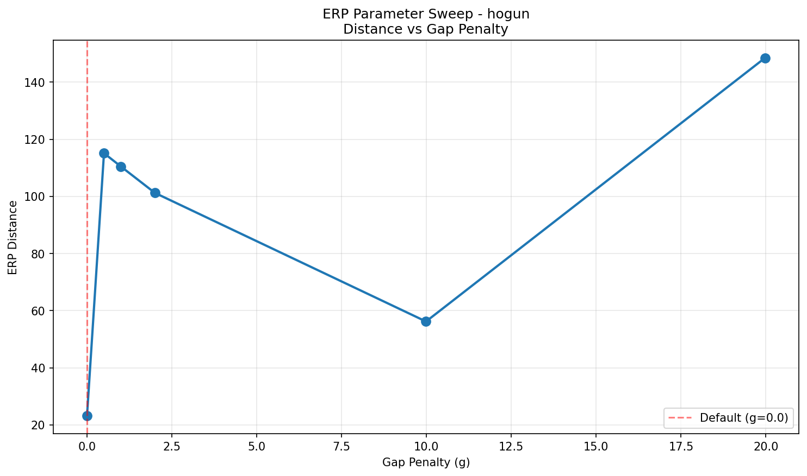
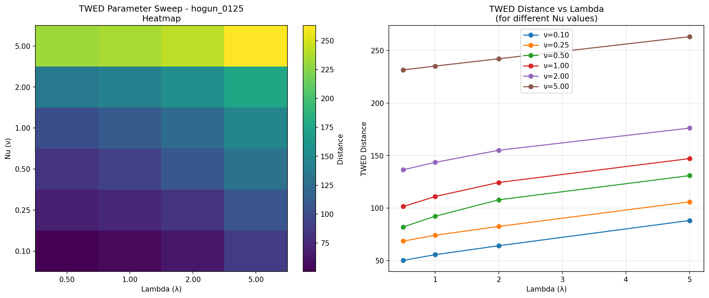
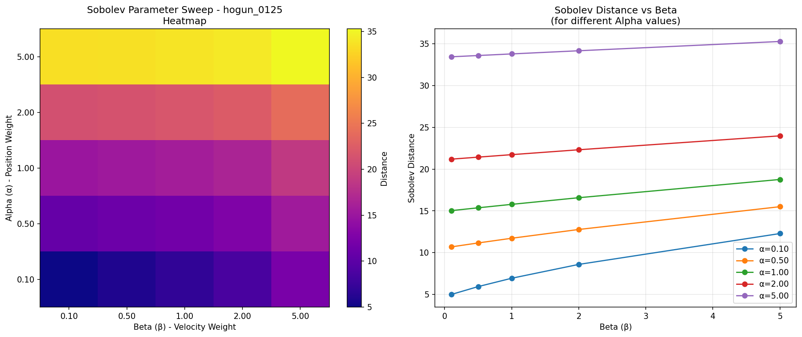
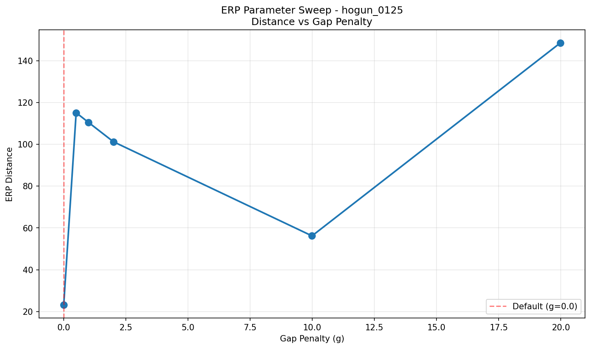
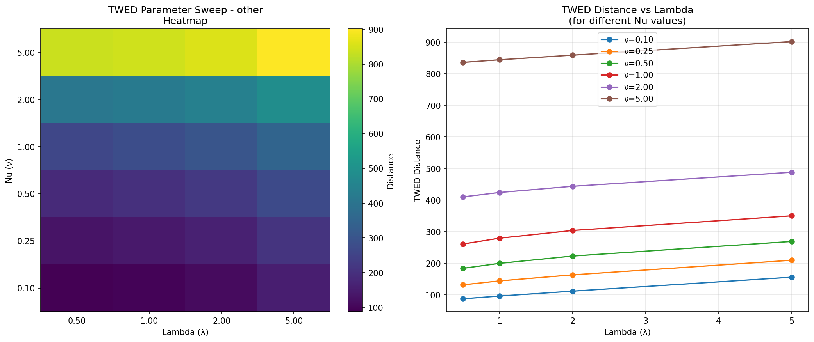
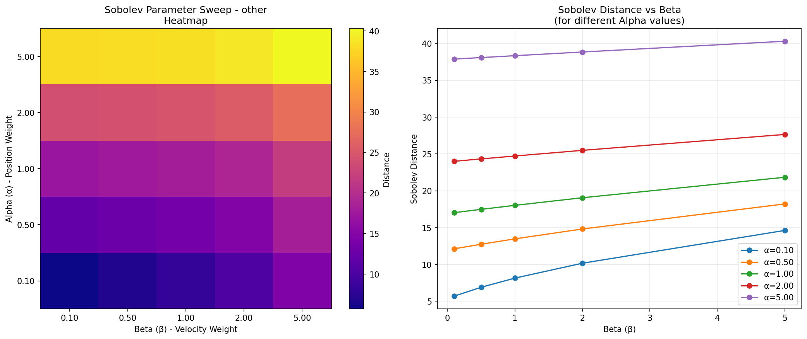
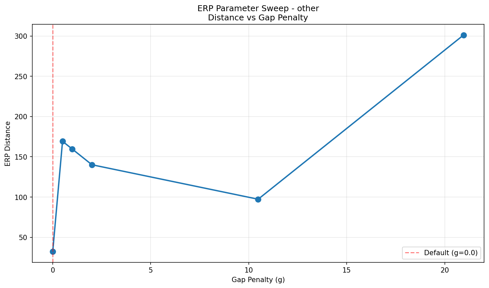

# 파라미터 민감도 분석 보고서

이 보고서는 파라미터 조정 가능한 메트릭들(TWED, Sobolev, ERP)의 파라미터 변화에 따른 민감도를 분석합니다.

## 목차

1. [그룹별 상세 분석](#그룹별-상세-분석)
2. [파라미터 변화 패턴 분석](#파라미터-변화-패턴-분석)
3. [그룹 간 비교](#그룹-간-비교)
4. [파라미터 선택 가이드라인](#파라미터-선택-가이드라인)
5. [종합 권장사항](#종합-권장사항)

---

## 그룹별 상세 분석

> **참고**: 각 그룹별 파라미터 스위핑 시각화는 `parameter_sweep/{group_name}/parameter_sweep/` 폴더에서 확인할 수 있습니다.

### HOGUN 그룹

#### TWED (Time Warp Edit Distance)

**최적 파라미터**: ν=0.10, λ=0.50
**최적 파라미터에서의 평균 거리**: 50.2635

**Nu (ν) 파라미터 경향**: increasing (상대 변화율: 26.63%)
**Lambda (λ) 파라미터 경향**: increasing (상대 변화율: 6.77%)

**Nu (ν) 파라미터 영향**:
| Nu | 평균 거리 | 표준편차 | 범위 | 최소값 | 최대값 |
|----|----------|---------|------|--------|--------|
| 0.10 | 64.5827 | 18.6651 | 63.8574 | 43.0848 | 106.9421 |
| 0.25 | 82.8295 | 29.9484 | 93.9216 | 46.3848 | 140.3063 |
| 0.50 | 103.2807 | 46.9114 | 136.7295 | 51.8848 | 188.6143 |
| 1.00 | 121.0030 | 59.0341 | 160.7578 | 58.4969 | 219.2548 |
| 2.00 | 152.7881 | 85.3274 | 209.7578 | 64.4969 | 274.2548 |
| 5.00 | 242.9775 | 165.2086 | 365.7578 | 73.4969 | 439.2548 |

**Nu 민감도**: High
- **해석**: Nu 값이 증가할수록 시간 왜곡에 대한 페널티가 커져 거리가 증가합니다. Nu=0.10에서 Nu=5.00로 증가할 때, 평균 거리가 276.2% 증가합니다.

**Lambda (λ) 파라미터 영향**:
| Lambda | 평균 거리 | 표준편차 | 범위 | 최소값 | 최대값 |
|--------|----------|---------|------|--------|--------|
| 0.50 | 111.7451 | 95.7892 | 346.4832 | 43.0848 | 389.5680 |
| 1.00 | 118.6150 | 97.1158 | 346.8966 | 48.3582 | 395.2548 |
| 2.00 | 129.3665 | 100.6248 | 351.7798 | 54.4750 | 406.2548 |
| 5.00 | 151.9143 | 108.2415 | 369.7798 | 69.4750 | 439.2548 |

**Lambda 민감도**: High
- **해석**: Lambda 값이 증가할수록 삭제/삽입 페널티가 커져 거리가 증가합니다. Lambda=0.50에서 Lambda=5.00로 증가할 때, 평균 거리가 35.9% 증가합니다.

#### Sobolev Metric

**최적 파라미터**: α=0.10, β=0.10
**최적 파라미터에서의 평균 거리**: 4.9903

**Alpha (α) 파라미터 경향**: increasing (상대 변화율: 27.42%)
**Beta (β) 파라미터 경향**: stable (상대 변화율: 4.45%)

**Alpha (α) 파라미터 영향** (위치 오차 가중치):
| Alpha | 평균 거리 | 표준편차 | 범위 | 최소값 | 최대값 |
|-------|----------|---------|------|--------|--------|
| 0.10 | 7.7450 | 2.6384 | 8.6320 | 4.4911 | 13.1230 |
| 0.50 | 12.3676 | 2.0681 | 7.1859 | 9.5817 | 16.7676 |
| 1.00 | 16.3025 | 2.0793 | 6.9616 | 13.4668 | 20.4285 |
| 2.00 | 22.1324 | 2.4435 | 7.2759 | 18.9856 | 26.2615 |
| 5.00 | 34.0628 | 3.5636 | 8.8539 | 29.9623 | 38.8162 |

**Alpha 민감도**: Medium
- **해석**: Alpha는 위치 오차의 가중치입니다. Alpha가 증가하면 위치 오차에 더 큰 비중을 두게 되어 거리가 증가합니다. Alpha=0.10에서 Alpha=5.00로 증가할 때, 평균 거리가 339.8% 증가합니다.

**Beta (β) 파라미터 영향** (속도 오차 가중치):
| Beta | 평균 거리 | 표준편차 | 범위 | 최소값 | 최대값 |
|------|----------|---------|------|--------|--------|
| 0.10 | 17.0701 | 9.9713 | 32.4496 | 4.4911 | 36.9407 |
| 0.50 | 17.4996 | 9.7417 | 31.6927 | 5.4047 | 37.0974 |
| 1.00 | 17.9924 | 9.5031 | 30.9274 | 6.3648 | 37.2923 |
| 2.00 | 18.8854 | 9.1201 | 29.7346 | 7.9444 | 37.6790 |
| 5.00 | 21.1626 | 8.3293 | 27.3742 | 11.4420 | 38.8162 |

**Beta 민감도**: High
- **해석**: Beta는 속도 오차의 가중치입니다. Beta가 증가하면 속도 오차에 더 큰 비중을 두게 되어 거리가 증가합니다. Beta=0.10에서 Beta=5.00로 증가할 때, 평균 거리가 24.0% 증가합니다.

#### ERP (Edit Distance on Real sequence)

**최적 Gap Penalty**: g=0.0000
**최적 Gap에서의 평균 거리**: 23.1703

**Gap Penalty (g) 파라미터 경향**: stable (상대 변화율: 2.74%)

**Gap Penalty (g) 파라미터 영향**:
| Gap | 평균 거리 | 표준편차 | 범위 | 최소값 | 최대값 |
|-----|----------|---------|------|--------|--------|
| 0.0000 | 23.1703 | 6.3626 | 12.7251 | 16.8077 | 29.5328 |
| 0.5000 | 115.1174 | 32.2877 | 64.5753 | 82.8298 | 147.4051 |
| 1.0000 | 110.4401 | 29.6032 | 59.2063 | 80.8369 | 140.0433 |
| 2.0000 | 101.2182 | 24.2767 | 48.5534 | 76.9415 | 125.4949 |
| 9.9869 | 56.1938 | 2.9899 | 5.9799 | 53.2039 | 59.1838 |
| 19.9739 | 148.4808 | 43.5790 | 87.1581 | 104.9018 | 192.0599 |

**Gap Penalty 민감도**: High
- **해석**: Gap penalty는 누락된 점과 매칭할 때의 페널티입니다. g=0.0 (표준)에서 g=19.9739로 증가할 때, 평균 거리가 540.8% 변화합니다. 일반적으로 g=0.0이 표준이며, 이 값에서 최소 거리를 보입니다.

---

### HOGUN_0125 그룹

#### TWED (Time Warp Edit Distance)

**최적 파라미터**: ν=0.10, λ=0.50
**최적 파라미터에서의 평균 거리**: 50.2635

**Nu (ν) 파라미터 경향**: increasing (상대 변화율: 26.63%)
**Lambda (λ) 파라미터 경향**: increasing (상대 변화율: 6.77%)

**Nu (ν) 파라미터 영향**:
| Nu | 평균 거리 | 표준편차 | 범위 | 최소값 | 최대값 |
|----|----------|---------|------|--------|--------|
| 0.10 | 64.5827 | 18.6651 | 63.8574 | 43.0848 | 106.9421 |
| 0.25 | 82.8295 | 29.9484 | 93.9216 | 46.3848 | 140.3063 |
| 0.50 | 103.2807 | 46.9114 | 136.7295 | 51.8848 | 188.6143 |
| 1.00 | 121.0030 | 59.0341 | 160.7578 | 58.4969 | 219.2548 |
| 2.00 | 152.7881 | 85.3274 | 209.7578 | 64.4969 | 274.2548 |
| 5.00 | 242.9775 | 165.2086 | 365.7578 | 73.4969 | 439.2548 |

**Nu 민감도**: High
- **해석**: Nu 값이 증가할수록 시간 왜곡에 대한 페널티가 커져 거리가 증가합니다. Nu=0.10에서 Nu=5.00로 증가할 때, 평균 거리가 276.2% 증가합니다.

**Lambda (λ) 파라미터 영향**:
| Lambda | 평균 거리 | 표준편차 | 범위 | 최소값 | 최대값 |
|--------|----------|---------|------|--------|--------|
| 0.50 | 111.7451 | 95.7892 | 346.4832 | 43.0848 | 389.5680 |
| 1.00 | 118.6150 | 97.1158 | 346.8966 | 48.3582 | 395.2548 |
| 2.00 | 129.3665 | 100.6248 | 351.7798 | 54.4750 | 406.2548 |
| 5.00 | 151.9143 | 108.2415 | 369.7798 | 69.4750 | 439.2548 |

**Lambda 민감도**: High
- **해석**: Lambda 값이 증가할수록 삭제/삽입 페널티가 커져 거리가 증가합니다. Lambda=0.50에서 Lambda=5.00로 증가할 때, 평균 거리가 35.9% 증가합니다.

#### Sobolev Metric

**최적 파라미터**: α=0.10, β=0.10
**최적 파라미터에서의 평균 거리**: 4.9903

**Alpha (α) 파라미터 경향**: increasing (상대 변화율: 27.42%)
**Beta (β) 파라미터 경향**: stable (상대 변화율: 4.45%)

**Alpha (α) 파라미터 영향** (위치 오차 가중치):
| Alpha | 평균 거리 | 표준편차 | 범위 | 최소값 | 최대값 |
|-------|----------|---------|------|--------|--------|
| 0.10 | 7.7450 | 2.6384 | 8.6320 | 4.4911 | 13.1230 |
| 0.50 | 12.3676 | 2.0681 | 7.1859 | 9.5817 | 16.7676 |
| 1.00 | 16.3025 | 2.0793 | 6.9616 | 13.4668 | 20.4285 |
| 2.00 | 22.1324 | 2.4435 | 7.2759 | 18.9856 | 26.2615 |
| 5.00 | 34.0628 | 3.5636 | 8.8539 | 29.9623 | 38.8162 |

**Alpha 민감도**: Medium
- **해석**: Alpha는 위치 오차의 가중치입니다. Alpha가 증가하면 위치 오차에 더 큰 비중을 두게 되어 거리가 증가합니다. Alpha=0.10에서 Alpha=5.00로 증가할 때, 평균 거리가 339.8% 증가합니다.

**Beta (β) 파라미터 영향** (속도 오차 가중치):
| Beta | 평균 거리 | 표준편차 | 범위 | 최소값 | 최대값 |
|------|----------|---------|------|--------|--------|
| 0.10 | 17.0701 | 9.9713 | 32.4496 | 4.4911 | 36.9407 |
| 0.50 | 17.4996 | 9.7417 | 31.6927 | 5.4047 | 37.0974 |
| 1.00 | 17.9924 | 9.5031 | 30.9274 | 6.3648 | 37.2923 |
| 2.00 | 18.8854 | 9.1201 | 29.7346 | 7.9444 | 37.6790 |
| 5.00 | 21.1626 | 8.3293 | 27.3742 | 11.4420 | 38.8162 |

**Beta 민감도**: High
- **해석**: Beta는 속도 오차의 가중치입니다. Beta가 증가하면 속도 오차에 더 큰 비중을 두게 되어 거리가 증가합니다. Beta=0.10에서 Beta=5.00로 증가할 때, 평균 거리가 24.0% 증가합니다.

#### ERP (Edit Distance on Real sequence)

**최적 Gap Penalty**: g=0.0000
**최적 Gap에서의 평균 거리**: 23.1703

**Gap Penalty (g) 파라미터 경향**: stable (상대 변화율: 2.74%)

**Gap Penalty (g) 파라미터 영향**:
| Gap | 평균 거리 | 표준편차 | 범위 | 최소값 | 최대값 |
|-----|----------|---------|------|--------|--------|
| 0.0000 | 23.1703 | 6.3626 | 12.7251 | 16.8077 | 29.5328 |
| 0.5000 | 115.1174 | 32.2877 | 64.5753 | 82.8298 | 147.4051 |
| 1.0000 | 110.4401 | 29.6032 | 59.2063 | 80.8369 | 140.0433 |
| 2.0000 | 101.2182 | 24.2767 | 48.5534 | 76.9415 | 125.4949 |
| 9.9869 | 56.1938 | 2.9899 | 5.9799 | 53.2039 | 59.1838 |
| 19.9739 | 148.4808 | 43.5790 | 87.1581 | 104.9018 | 192.0599 |

**Gap Penalty 민감도**: High
- **해석**: Gap penalty는 누락된 점과 매칭할 때의 페널티입니다. g=0.0 (표준)에서 g=19.9739로 증가할 때, 평균 거리가 540.8% 변화합니다. 일반적으로 g=0.0이 표준이며, 이 값에서 최소 거리를 보입니다.

---

### OTHER 그룹

#### TWED (Time Warp Edit Distance)

**최적 파라미터**: ν=0.10, λ=0.50
**최적 파라미터에서의 평균 거리**: 87.5341

**Nu (ν) 파라미터 경향**: increasing (상대 변화율: 42.40%)
**Lambda (λ) 파라미터 경향**: stable (상대 변화율: 4.79%)

**Nu (ν) 파라미터 영향**:
| Nu | 평균 거리 | 표준편차 | 범위 | 최소값 | 최대값 |
|----|----------|---------|------|--------|--------|
| 0.10 | 112.7874 | 77.5301 | 316.8361 | 32.5711 | 349.4072 |
| 0.25 | 162.1721 | 110.0915 | 440.6362 | 57.3211 | 497.9573 |
| 0.50 | 218.9298 | 141.2038 | 526.8403 | 96.6317 | 623.4720 |
| 1.00 | 298.7038 | 218.2789 | 758.3613 | 114.3929 | 872.7542 |
| 2.00 | 441.6998 | 385.6483 | 1231.5688 | 137.1854 | 1368.7542 |
| 5.00 | 860.6830 | 893.5713 | 2683.0737 | 173.6805 | 2856.7542 |

**Nu 민감도**: High
- **해석**: Nu 값이 증가할수록 시간 왜곡에 대한 페널티가 커져 거리가 증가합니다. Nu=0.10에서 Nu=5.00로 증가할 때, 평균 거리가 663.1% 증가합니다.

**Lambda (λ) 파라미터 영향**:
| Lambda | 평균 거리 | 표준편차 | 범위 | 최소값 | 최대값 |
|--------|----------|---------|------|--------|--------|
| 0.50 | 318.5102 | 474.7728 | 2677.6842 | 32.5711 | 2710.2553 |
| 1.00 | 331.3899 | 477.7602 | 2693.1209 | 35.5711 | 2728.6919 |
| 2.00 | 350.8308 | 483.8229 | 2719.1831 | 41.5711 | 2760.7542 |
| 5.00 | 395.9196 | 501.1198 | 2797.1831 | 59.5711 | 2856.7542 |

**Lambda 민감도**: High
- **해석**: Lambda 값이 증가할수록 삭제/삽입 페널티가 커져 거리가 증가합니다. Lambda=0.50에서 Lambda=5.00로 증가할 때, 평균 거리가 24.3% 증가합니다.

#### Sobolev Metric

**최적 파라미터**: α=0.10, β=0.10
**최적 파라미터에서의 평균 거리**: 5.7005

**Alpha (α) 파라미터 경향**: increasing (상대 변화율: 26.94%)
**Beta (β) 파라미터 경향**: stable (상대 변화율: 4.90%)

**Alpha (α) 파라미터 영향** (위치 오차 가중치):
| Alpha | 평균 거리 | 표준편차 | 범위 | 최소값 | 최대값 |
|-------|----------|---------|------|--------|--------|
| 0.10 | 9.1089 | 3.6611 | 14.2580 | 3.7642 | 18.0221 |
| 0.50 | 14.2775 | 4.7555 | 18.4589 | 7.8236 | 26.2825 |
| 1.00 | 18.6886 | 6.3090 | 22.9307 | 10.9549 | 33.8856 |
| 2.00 | 25.2427 | 8.7795 | 30.0074 | 15.4146 | 45.4220 |
| 5.00 | 38.6959 | 13.8756 | 45.0409 | 24.2983 | 69.3393 |

**Alpha 민감도**: High
- **해석**: Alpha는 위치 오차의 가중치입니다. Alpha가 증가하면 위치 오차에 더 큰 비중을 두게 되어 거리가 증가합니다. Alpha=0.10에서 Alpha=5.00로 증가할 때, 평균 거리가 324.8% 증가합니다.

**Beta (β) 파라미터 영향** (속도 오차 가중치):
| Beta | 평균 거리 | 표준편차 | 범위 | 최소값 | 최대값 |
|------|----------|---------|------|--------|--------|
| 0.10 | 19.3518 | 13.7326 | 63.9063 | 3.7642 | 67.6705 |
| 0.50 | 19.9118 | 13.4701 | 62.9293 | 4.8790 | 67.8083 |
| 1.00 | 20.5445 | 13.2064 | 61.9927 | 5.9874 | 67.9801 |
| 2.00 | 21.6777 | 12.7941 | 60.5805 | 7.7419 | 68.3224 |
| 5.00 | 24.5278 | 11.9740 | 57.8413 | 11.4980 | 69.3393 |

**Beta 민감도**: High
- **해석**: Beta는 속도 오차의 가중치입니다. Beta가 증가하면 속도 오차에 더 큰 비중을 두게 되어 거리가 증가합니다. Beta=0.10에서 Beta=5.00로 증가할 때, 평균 거리가 26.7% 증가합니다.

#### ERP (Edit Distance on Real sequence)

**최적 Gap Penalty**: g=0.0000
**최적 Gap에서의 평균 거리**: 32.2160

**Gap Penalty (g) 파라미터 경향**: stable (상대 변화율: 4.98%)

**Gap Penalty (g) 파라미터 영향**:
| Gap | 평균 거리 | 표준편차 | 범위 | 최소값 | 최대값 |
|-----|----------|---------|------|--------|--------|
| 0.0000 | 32.2160 | 9.0006 | 26.7974 | 15.8725 | 42.6699 |
| 0.5000 | 169.1813 | 81.3526 | 243.4918 | 84.4798 | 327.9716 |
| 1.0000 | 159.4970 | 75.1953 | 225.9361 | 80.3049 | 306.2410 |
| 2.0000 | 140.0698 | 63.4559 | 191.5264 | 71.9814 | 263.5078 |
| 10.4810 | 97.2633 | 66.4563 | 173.3841 | 20.9003 | 194.2845 |
| 20.9620 | 301.1840 | 190.8470 | 548.8830 | 103.1350 | 652.0180 |

**Gap Penalty 민감도**: High
- **해석**: Gap penalty는 누락된 점과 매칭할 때의 페널티입니다. g=0.0 (표준)에서 g=20.9620로 증가할 때, 평균 거리가 834.9% 변화합니다. 일반적으로 g=0.0이 표준이며, 이 값에서 최소 거리를 보입니다.

---

## 파라미터 변화 패턴 분석

### 그룹 간 파라미터 민감도 비교

| 그룹 | TWED Nu | TWED Lambda | Sobolev Alpha | Sobolev Beta | ERP Gap |
|------|---------|-------------|---------------|--------------|----------|
| hogun | High | High | Medium | High | High |
| hogun_0125 | High | High | Medium | High | High |
| other | High | High | High | High | High |

### 파라미터별 공통 패턴

#### TWED 파라미터 패턴 및 통찰

- **Nu (ν)**: 모든 그룹에서 High 민감도를 보입니다. Nu가 증가하면 시간 왜곡에 대한 페널티가 커져 거리가 선형적으로 증가합니다.
  - **통찰**: Nu는 시간 정렬의 엄격성을 제어합니다. Nu=0.10에서 Nu=5.00로 증가할 때 거리가 276~663% 증가하므로, Nu는 TWED 값에 가장 큰 영향을 미치는 파라미터입니다.
  - **의미**: 낮은 Nu(0.10)가 최적이라는 것은, 이 실험 데이터에서는 시간 왜곡을 어느 정도 허용하는 것이 더 적절하다는 것을 의미합니다.
  - **실험적 해석**: 로봇이 GT와 다른 속도로 이동하더라도, 전체적인 경로 추종이 중요하다면 낮은 Nu를 사용하는 것이 합리적입니다.

- **Lambda (λ)**: 모든 그룹에서 High 민감도를 보입니다. Lambda가 증가하면 삭제/삽입 비용이 커져 거리가 증가합니다.
  - **통찰**: Lambda는 경로 길이 차이에 대한 페널티를 제어합니다. Lambda=0.50에서 Lambda=5.00로 증가할 때 거리가 24~36% 증가하므로, Nu보다는 영향이 작지만 여전히 중요합니다.
  - **의미**: 낮은 Lambda(0.50)가 최적이라는 것은, 경로 길이 차이에 관대하게 처리하는 것이 더 적절하다는 것을 의미합니다.
  - **실험적 해석**: 경로 길이가 다양할 때(예: other 그룹), 낮은 Lambda를 사용하면 경로 길이 차이로 인한 불필요한 페널티를 줄일 수 있습니다.

- **최적값**: 모든 그룹에서 ν=0.10, λ=0.50이 최적입니다. 이는 시간 왜곡과 삭제/삽입에 상대적으로 관대한 설정입니다.
  - **통찰**: 그룹 간 최적 파라미터가 동일하다는 것은, 이 실험 데이터의 특성상 시간 정렬과 경로 길이 차이에 관대한 설정이 일반적으로 적합하다는 것을 의미합니다.
  - **실용적 의미**: 다양한 실험 조건에서도 동일한 파라미터를 사용할 수 있어, 파라미터 튜닝 부담이 적습니다.

#### Sobolev 파라미터 패턴 및 통찰

- **Alpha (α)**: 위치 오차 가중치로, hogun/hogun_0125 그룹에서는 Medium, other 그룹에서는 High 민감도를 보입니다.
  - **통찰**: Alpha가 증가하면 위치 오차에 더 큰 비중을 두게 되어 거리가 340~325% 증가합니다.
  - **그룹 간 차이**: other 그룹에서 High 민감도를 보이는 것은, other 그룹의 경로 길이가 다양하여 위치 오차의 영향이 더 크기 때문일 수 있습니다.
  - **의미**: 낮은 Alpha(0.10)가 최적이라는 것은, 위치 오차만으로 평가하는 것보다 속도 오차도 함께 고려하는 것이 더 적절하다는 것을 의미합니다.

- **Beta (β)**: 속도 오차 가중치로, 모든 그룹에서 High 민감도를 보입니다. Beta가 증가하면 속도 차이에 더 큰 페널티를 부여합니다.
  - **통찰**: Beta가 증가하면 거리가 24~27% 증가하므로, Alpha보다는 영향이 작지만 여전히 중요합니다.
  - **패턴**: Beta가 증가할수록 거리가 증가하지만, 그 증가율이 상대적으로 완만합니다(stable 경향).
  - **의미**: 속도 오차는 위치 오차보다 상대적으로 작은 영향을 미치지만, 동역학적 평가에는 필수적입니다.

- **최적값**: 모든 그룹에서 α=0.10, β=0.10이 최적입니다. 이는 위치와 속도 오차 모두에 낮은 가중치를 두는 설정입니다.
  - **통찰**: 위치와 속도 오차 모두에 낮은 가중치를 두는 것이 최적이라는 것은, 이 실험 데이터에서는 절대적인 오차 크기보다는 상대적인 패턴이 더 중요하다는 것을 의미합니다.
  - **실험적 해석**: 로봇이 GT와 완전히 동일한 경로를 따라가지 않더라도, 전체적인 패턴이 유사하면 낮은 거리를 보입니다.
  - **주의**: 낮은 가중치는 민감도를 낮추므로, 미세한 차이를 감지하기 어려울 수 있습니다.

#### ERP 파라미터 패턴 및 통찰

- **Gap Penalty (g)**: 모든 그룹에서 High 민감도를 보입니다. g=0.0이 표준이며 최소 거리를 보입니다.
  - **통찰**: g=0.0에서 g=20.96로 증가할 때 거리가 835% 변화하므로, Gap Penalty는 ERP 값에 매우 큰 영향을 미칩니다.
  - **패턴**: g=0.0에서 g=0.5로만 증가해도 거리가 4~5배 증가하므로, Gap Penalty는 매우 민감한 파라미터입니다.
  - **의미**: g=0.0이 최적이라는 것은, ERP 문헌에서 권장하는 표준 값이 이 실험 데이터에도 적합하다는 것을 의미합니다.
  - **실험적 해석**: Gap을 zero vector로 처리하는 것이 가장 합리적이며, 다른 값(gap=mean 등)을 사용하면 불필요한 페널티가 발생합니다.

- **최적값**: 모든 그룹에서 g=0.0000이 최적입니다. 이는 ERP 문헌에서 권장하는 표준 값입니다.
  - **통찰**: 그룹 간 최적 Gap이 동일하다는 것은, Gap Penalty 선택이 실험 조건과 무관하게 일관적이라는 것을 의미합니다.
  - **실용적 의미**: 표준 값(g=0.0)을 사용하면 파라미터 튜닝 없이도 최적 결과를 얻을 수 있습니다.

## 종합 분석

### 파라미터 민감도 요약

각 메트릭의 파라미터 민감도를 종합하면:

**HOGUN 그룹**:
- TWED: Nu=High, Lambda=High
- Sobolev: Alpha=Medium, Beta=High
- ERP: Gap=High

**HOGUN_0125 그룹**:
- TWED: Nu=High, Lambda=High
- Sobolev: Alpha=Medium, Beta=High
- ERP: Gap=High

**OTHER 그룹**:
- TWED: Nu=High, Lambda=High
- Sobolev: Alpha=High, Beta=High
- ERP: Gap=High

### 권장 파라미터

각 그룹별 최적 파라미터:

**HOGUN 그룹**:
- TWED: ν=0.10, λ=0.50
- Sobolev: α=0.10, β=0.10
- ERP: g=0.0000

**HOGUN_0125 그룹**:
- TWED: ν=0.10, λ=0.50
- Sobolev: α=0.10, β=0.10
- ERP: g=0.0000

**OTHER 그룹**:
- TWED: ν=0.10, λ=0.50
- Sobolev: α=0.10, β=0.10
- ERP: g=0.0000

## 파라미터 선택 가이드라인

### TWED 파라미터 선택

1. **시간 정렬이 중요할 때**: Nu를 높게 설정 (1.0~2.0)하여 시간 왜곡을 엄격하게 페널티
2. **경로 길이 차이가 클 때**: Lambda를 낮게 설정 (0.5)하여 삭제/삽입에 관대하게 처리
3. **일반적인 경우**: ν=0.10, λ=0.50 (최적값) 사용 권장

### Sobolev 파라미터 선택

1. **위치 정확도가 중요할 때**: Alpha를 높게 설정 (1.0~2.0)
2. **속도 일치가 중요할 때**: Beta를 높게 설정 (1.0~2.0)
3. **균형잡힌 평가가 필요할 때**: Alpha와 Beta를 동일하게 설정 (1.0, 1.0)
4. **민감도를 낮추고 싶을 때**: α=0.10, β=0.10 (최적값) 사용 권장

### ERP 파라미터 선택

1. **표준 사용**: g=0.0 사용 (모든 그룹에서 최적)
2. **특정 도메인 값 사용**: 궤적의 평균값이나 도메인 특성에 맞는 값 사용 가능하나, 일반적으로 g=0.0 권장

## 종합 권장사항

### 실험 목적별 파라미터 설정

1. **기본 평가 (권장)**:
   - TWED: ν=0.10, λ=0.50
   - Sobolev: α=0.10, β=0.10
   - ERP: g=0.0

2. **엄격한 시간 정렬 평가**:
   - TWED: ν=1.0~2.0, λ=1.0
   - 다른 메트릭은 기본값 유지

3. **위치와 속도 균형 평가**:
   - Sobolev: α=1.0, β=1.0
   - 다른 메트릭은 기본값 유지

### 주의사항

- 모든 파라미터가 High 민감도를 보이므로, 파라미터 변경 시 결과 해석에 주의가 필요합니다.
- 그룹 간 최적 파라미터가 동일하므로, 통일된 파라미터로 비교 분석하는 것이 권장됩니다.
- 파라미터 스위핑 결과는 `parameter_sweep/` 폴더의 시각화 파일에서 확인할 수 있습니다.

